# GATHERING, VISUALIZING AND USING EXISTING DATA FROM AHN AND 3DBAG (THE NETHERLANDS)

## Overview 
### Learning aim
To use existing data as a basis for 3d modeling.
### Learning objectives
After this exercise you have to be are able to:
-	Gather data from AHN
-	Edit and use GeoTiff files
-	Gather data from 3DBAG
-	Edit and use OBJ files

### Expected time investment
2 hours

### Required material & Data
-	AHN
-	TerreSculptor
-	3DBAG
-	Blender

### Deliverables/products
No deliverable requested (you can show your result to the teacher if you want)

 
## Exercise content

* Gathering data from AHN
* Installing and getting to know TerreSculptor
* Editing and exporting GeoTiff data using TerreSculptor
* Gathering data from 3DBAG
* Installing and getting to know Blender
* Combining wavefront OBJ data in Blender

During the work on this tutorial, you are expected to keep your files organised on your computer.

____
____
## Task
### 1. Gathering data from AHN
The AHN provides height information for the entire Netherlands, these height information can be used as a base landscape for further 3d modelling work or combined with the geometric vector model of building for 3D city model generation. AHN data is acquired via LiDAR aerial survey. 
1.	Go to https://ahn.arcgisonline.nl/ahnviewer/ and to enable downloads, go to “List of Layers” or “lijst met lagen” and enable “AHN1, 2 en 3 – Downloads per kaartblad”
 
2.	Navigate to the University of Twente (campus) in Enschede (or the area of your interest) by either the search bar or by zooming in.
    

3.	The University of Twente is right on the edge of two data blocks, however, for this tutorial, only the right part is used. This is the block with the name 34fn2. Download the file “AHN4 0,5 meter raster DSM”. This is a Digital Surface model terrain data.

    

The data type for this file is GeoTiff and each pixel is 0.5m. Since the resolution of the entire file is 10000 x 12500, it covers an area of 5 x 6.25 km. You can download the original point cloud data format which is .LAZ file format. However, since this is very accurate data (many points per sq.m) this .LAZ files are quite big and require a lot of computational power to process. For future work you can download and either crop small area or reduced the point density. For the current tutorial, we will not be using this data type.

[comment]: # (@milankoeva I do not understand the need for Twinmotion for clipping the raster, can't it be done just with QGIS?)

### 2. Gathering data from 3DBAG
The terrain of the university campus is now complete, in this chapter the data of the existing buildings will be gathered.
1.	Go to https://3dbag.nl/en/download and click the button “Pick a tile”

2.	Move the map to the university campus of Enschede and you will see that the building data for the area of the campus that is in the previously created terrain, requires 3 tiles. These tiles are 2345, 5106 and 5107. For each of  these tiles, the next step has to be made.

    

3.	Select a tile and click the “Confirm selection” button. In this exercise we will use the .OBJ format so download that file by clicking on it. OBJ files are supported by nearly all 3D softwares. Whereas the GeoPackage (GPKG) is used in GIS software like ArcGIS or QGIS, for more information about GPKG and how to use it visit: https://docs.3dbag.nl/en/delivery/gpkg/. The CityJSON file format is specifically made for 3D city models and more information can be found at: https://docs.3dbag.nl/en/delivery/cityjson/. Finally, CityJSON can also be imported into Blender using the following add-on, however, please keep in mind that this method is not 100% bug free: https://github.com/cityjson/Up3date 

4.	Now you should have 3 zip files, one for each of the tiles. Extract each of them and you will that for each tile you have 3 .obj models, each with a different LOD setting. Each of these models have a corresponding .mtl file which stores the material settings for the .obj model. Depending on the scale of the project and the graphical power of your computer, you can use any of the LOD’s, the remainder of this tutorial uses LOD2.2. For more information about the different LOD’s, visit: https://docs.3dbag.nl/en/schema/concepts/ 
 
### 3. Combining wavefront OBJ data in Blender
1.	Import the OBJ data using File -> Import -> Wavefront (.obj)
 
    

2.	Navigate to one of the three folders containing the .obj files for the tile data from 3DBAG and select one of the LOD’s. I recommend using the lod22 version since it gives the most detail, but if your computer is unable to handle it, you could use a lower LOD. Under “Transform” make sure that the “Up” setting is set to Z Up and that under “Geometry”, “Split by Object” is turned off. When this is done, click the “Import OBJ” button. Do this for all three different tiles.

    

3.	Because the objects are placed in Blender using real-world coordinates instead of centered around the origin, you should not be able to see them at the origin. The objects being far away from the origin causes them to flicker in Blender. Focus the camera on the objects by selecting them in the Scene Collection and pressing the “.” on the numPad when your mouse cursor hovers over viewport use View -> Frame Selected. You will now view the models, but you won’t be able to see anything.

4.	To fix that, press “N” on the keyboard to open up some additional settings. Go to View, and change the End setting from 1000 to 10000. This allows to camera to see 10km away instead of 1km. You should now be able to see the model, although it may flicker a lot.
 
    
5.	With the three objects selected, press “ctrl” + “J” to join them together

6.	Now that you only have a single object, with that object selected, press the “tab” button To enter edit mode.a This might take a while. Make sure that everything is selected, you (de)select everything by pressing A. If everything that is selected is shown in orange.a
7.	In the window with extra setting that showed up at 4. go to Item and under Transform, set the X and Y and Z coordinates to 0 (note that it will not stay at 0).
 
    

8.	After that is done, once again focus the camera on the object (step 3.) and now you should see the model just fine.

9.	Now to fix the orientation of the model, so to have North actually point North, in the properties tab, select Object Properties and set the Z rotation to 0
 
    

10.	Finally, to allow for more flexibility in the future, we want to have each object separated instead of combined. So select the object, be sure that you are in edit mode, make sure everything is selected by pressing A and then everything should be orange. Then press P and select “By Loose Parts”. You can also use the toolbar, by pressing Mesh -> Separate -> By Loose Parts. Now you should have many objects in the Scene Collection. 
11.	The models can now be exported and used in another program.
Go to File -> Export -> Wavefront (.obj) and press the “Export OBJ” button.

---

## Making a 2D building plot in QGIS and exporting it to Blender

### Overview 
####	Learning aim
To create a 2D feature in QGIS and use it in Blender
####	Learning objectives
-	Create a feature in QGIS
-	Export a feature in QGIS to a shapefile
-	Import shapefiles in Blender
-	Add a reference image in Blender
####	Type
Exercise
####	Expected time investment
2 hours
####	Required material & Data
-	QGIS
-	Blender
-	A mouse
####	Deliverables/products

####	Assessment and feedback

####	Exercise content
-	Installing QGIS and creating a new project
-	Creating a feature on a map in QGIS and exporting it
-	Installing and getting to know Blender
-	Importing and adjusting a shapefile in Blender

In this exercise, it is expected of you to save the files and keep them organised yourself.

### Creating a new QGIS project

1. Start QGIS.
2. Press `Ctrl+N` to create a new project or click the corresponding button in QGIS. Your window should look as shown below:

    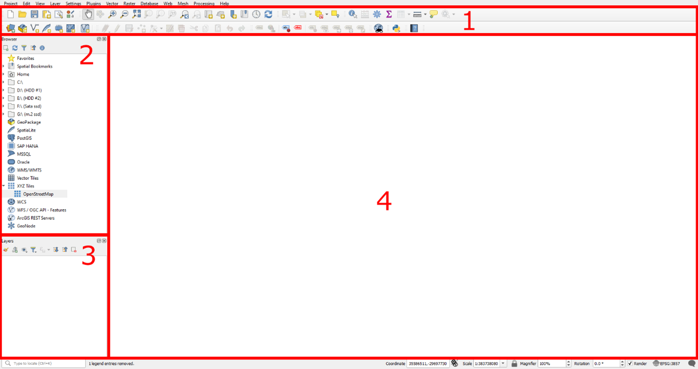

   - **1. Toolbar**: All tools can be found here.
   - **2. Browser**: Use to add data.
   - **3. Layers**: Shows the layers currently added to the project.
   - **4. Viewport**: Displays your layers.
3. The Netherlands uses the RD New coordinate system, with the ellipsoid Besel 1841. To set this:
   - Press `Ctrl+Shift+P` or go to `Project -> Properties…`.
   - Under the measurements tab, set the Ellipsoid to Besel 1841. Press `Apply` and `OK`.
   - In the `CRS` tab, set the coordinate system to RD New.

    

    

4. In the Browser, under `XYZ Tiles`, double-click OpenStreetMap to add the world map to the layers.

    

5. Zoom in and navigate the viewport to the campus of Enschede.

    

---

### Creating a Feature on a Map in QGIS and Exporting It

In this chapter we will determine the location of a new building on the campus and a basic layout will also be created. You do not have to make this exact layout, instead, be creative and try to create something on your own.

1. In the north side of the Horst complex, there are parking spots. Above that, there is a large plot of land for the new building.

    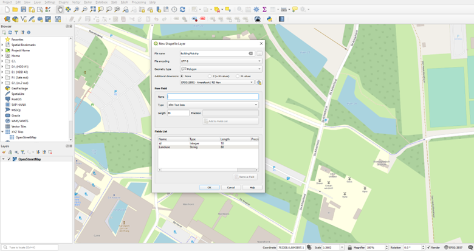

2. Create a new shapefile layer by pressing the button in the toolbar. Set:
   - File name.
   - Geometry type to Polygon.
   - Coordinate system to RD New.
   - Confirm by pressing `OK`.

    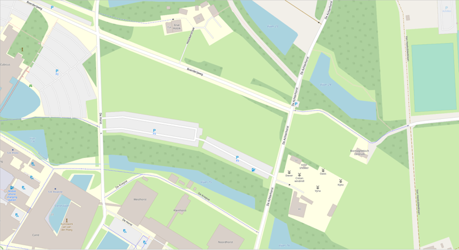

3. Select the new layer in the `Layers` tab and enable editing by pressing `Toggle Editing` in the toolbar.
4. With the Add Polygon button pressed, you can create a polygon by left clicking where you want a vertex of the polygon to be. When you have a shape that you want the building to be, simply press the right mouse button. In the popup window, you do not have to set the id.

    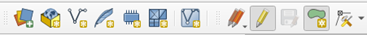

    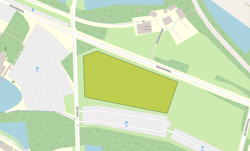

5. A giant concrete block as a building might be in style with the rest of the campus, however it is not very modern. So we will also add water in the mid-dle of the building. 
   - Go to `Vector -> Geoprocessing Tools -> Buffer…`.
   - Set the created polygon as input, distance (e.g., -20), and style options. Run the tool.
   - The minus ensures that the buffer will be to the inside. Set the End cap style to Flat and the Join style to Miter. 
   - Finally press Run, this should result in a new layer called Buffered.

    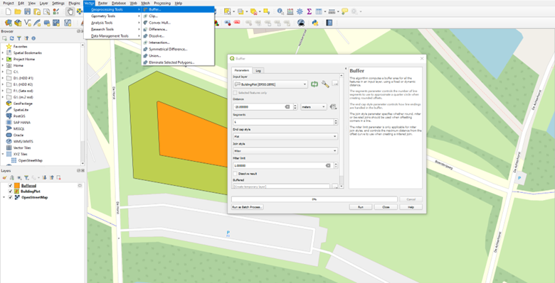

6. Use the `Difference` tool to cut out the building by selecting the building as the input layer and the buffered layer as the overlay.

    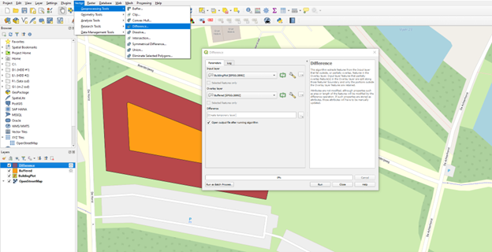

7. The water feature that the building surrounds should of course also be connected to the rest of the water network. It will therefore be connected to the water south of the parking spots. For this select the Buffered layer, enable edit mode and once again press the Add Polygon button. Con-nect the two water areas like seen below with a new polygon

    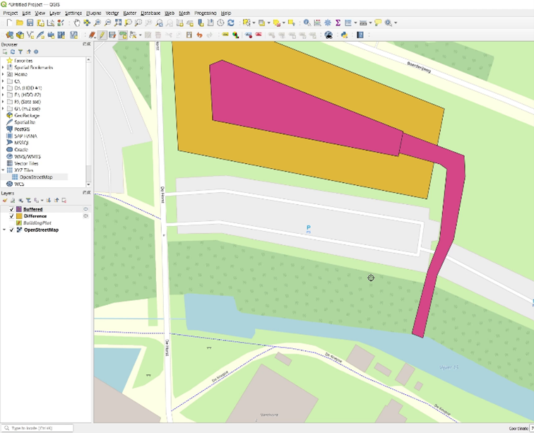

8. Export the Difference (Building) and Buffered (Water) layers:
   - Right-click the Layer, select `Export -> Save Features As…`.
   - Set the format to ESRI Shapefile and save both layers.

    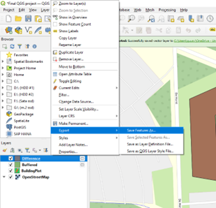

9. Make the difference and buffered plots permanent by right-clicking and selecting `Make Permanent`.

---

## Blender GIS

1. To import shapefiles in Blender, an additional add-on is required. Download the BlenderGIS addon from [https://github.com/domlysz/BlenderGIS/releases/tag/228](https://github.com/domlysz/BlenderGIS/releases/tag/228).

    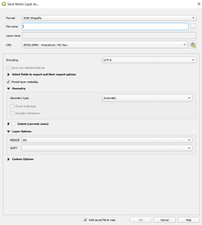

2. In Blender, go to `Edit -> Preferences…`, select `Add-ons`, click `Install`, and select the downloaded zip file.

    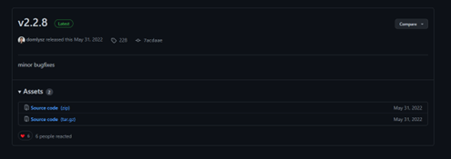

7. In the list of Add-ons, find BlenderGIS and enable it by checking the box.

    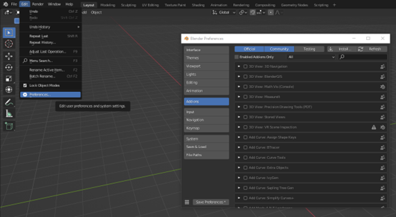

8. You should see a new `GIS` button in the toolbar.

    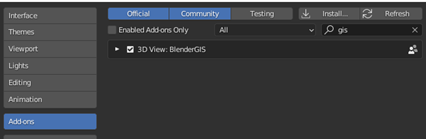

    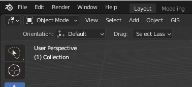

---

### Importing and Adjusting a Shapefile in Blender

1. Use `GIS -> Import -> Shapefile (.shp)` to import the building plot shapefile. Navigate to where you saved the shapefile of the building plot and press the “Import SHP” but-ton. On the popup screen, just click OK.
2. Select the water object and Enter edit mode with `Tab` and select vertex mode. in the toolbar select the vertex select mode. This allows you too see the individual vertexes and edit them. 3D models exist out of three things, vertexes, edges and faces. Vertexes are points, edges connect vertexes and faces connect edges. All three can be selected here.  Edit vertexes as needed.

    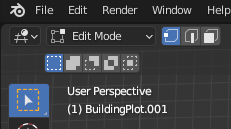

3. Currently a couple of vertexes are unconnected because they came from separate objects. So zoom into the place where the two objects meet (hint, press `num-7` on the numpad, or click the “Z” in the camera controls to look from directly above). 
4. The vertexes of the model that connects the two water bodies need to be merged at the location of the vertexes of the water cut out. There are two pairs that you have to merge, these have to be done separately. Merge unconnected vertexes by selecting two vertexes and pressing `M -> At Last`.

    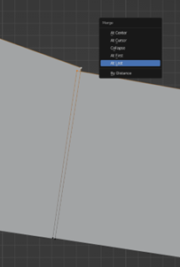

5. Do the same for the other pair and press tab to exit the edit mode
6. Hide the “Water” object by clicking the eye icon in the Scene collection and Select the “Building” object. Once again press tab to enter edit mode.	

    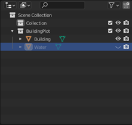

5. We only want the building to be part of the model, as it currently is, the water is also modelled. Now select the face select mode in the toolbar (see 5.) and select the face that is in the middle of what should be water. Delete faces where the water should be by selecting them and pressing `X -> Only Faces`.
6. Now there won’t be any faces left and we only want faces on the outer ring. To do this, set the select mode to edge select. Reconnect the outer ring edges by selecting two opposing edges and pressing `F`. Do this for all 5 opposing edge pairs. To completely fill in the outer ring.

    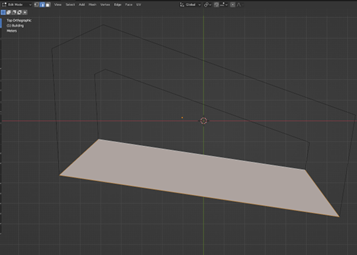

7. Finally, we would like to see in the building object where the water passes under the building. To do this, select the building object and enter edit mode. Make sure everything is selected, you can (de)select everything by pressing `A`. Then in the Scene Collection, select the water object and in the toolbar go to `Mesh -> Knife Project`. This tool uses the second selected object to cut through the main object.  Use the `Knife Project` tool to cut out the water passage from the building.

    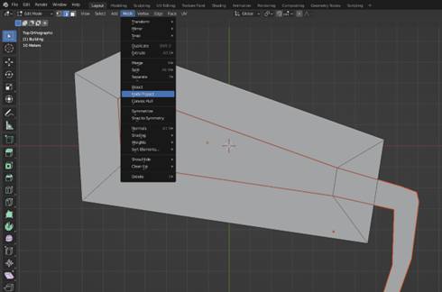

10.	Having a reference image is also great to have when modelling a building. So we will ad the sur-roundings of the campus to the background. For this you need an image of the surrounding ar-ea. You could take this from QGIS, OSM, Google, etc. you can find an image. Save that image and simply drag it into your Blender viewport (no georeferencing), the image will be placed per-fectly in front of you.

    Since you want the reference to be on the ground in this case, make sure you are looking at the model perfectly from above (see step 3.). You do have to rescale and position the image your-self. The viewport might than look something like this.

    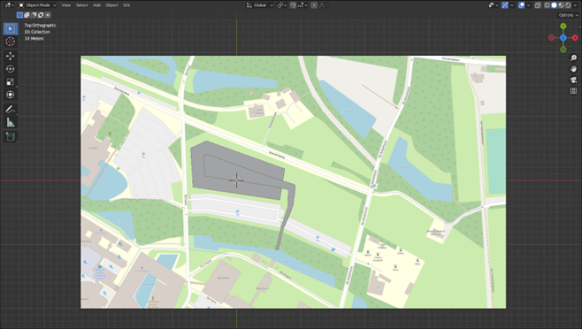

11. Finally since we do not wish to change or select the reference image, we make it un-selectable by in the scene collection, enable the button as shown below

    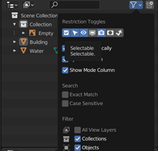

12. Make the reference image unselectable by disabling its selectability in the Scene collection.

    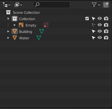

13. Save the Blender file.

## Creating a 3D road network from OSM data

### Setting up QGIS

1. Open the previous QGIS File, or create a new one, where the ellipsoid is Bessel 1841 and the coordinate system is RD New (EPSG:28992).

7.	In the toolbar under Plugins, click `Manage and Install Plugins…` In the Not installed tab, search for *QuickOSM*, select it and press the Install Plugin button. You can now close the plugins window.

    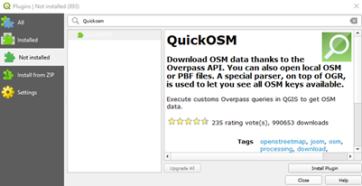
 
8.	In the Browser, under XYZ Tiles, double click OpenStreetMap to add the world map to the layers. If any transformation requests appear, just press “OK”.

    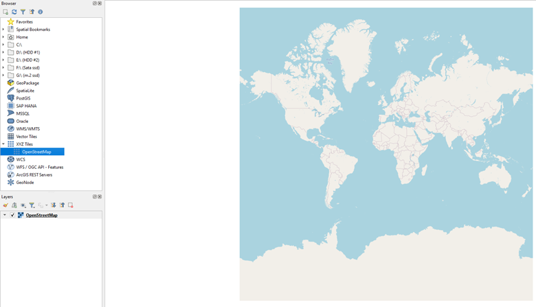
 
9.	Zoom in and navigate the viewport to the campus of Enschede

    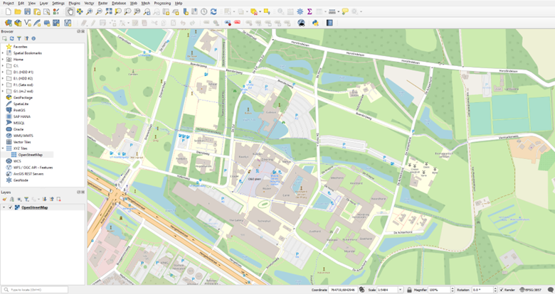
 
### Importing OSM data into QGIS
1.	First, you want to set a boundary of the OSM data you need. So, create a new shapefile layer, give it a name, set the geometry type to Polygon, and set the coordinate system to RD New, finally press OK to create the layer.

    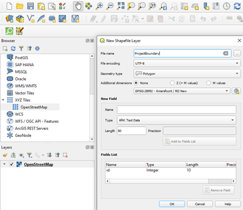
 
2.	Draw a feature by selecting the new layer in the layers tab, pressing the `edit` button and finally click the `Create polygon.`

    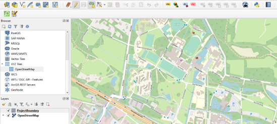
 
3.	With the `Add Polygo`n button enables, you can create a polygon by left clicking where you want a vertex of the polygon to be. Draw the polygon a further than the extends of the campus. When you have a shape that you want the boundary of the OSM data to be, simply press the right mouse button. In the popup window, you do not have to set the id. Try to select a polygon with a similar extent as below, as the rest of this tutorial is based on the following. 

    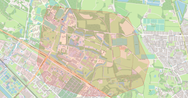
 
4.	Now import the OSM data using the created layer as its boundary by using the QuickOSM plugin. Navigate to it by in the toolbar pressing `Vector -> QuickOSM -> QuickOSM…`

    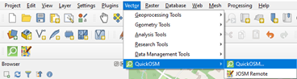
 
5.	In the QuickOSM window, change the `“In”` box to `“Layer Extend”` and set it to the layer you just created. Then at the bottom, press Run query and wait until all the data is gathered, this might take a while.

    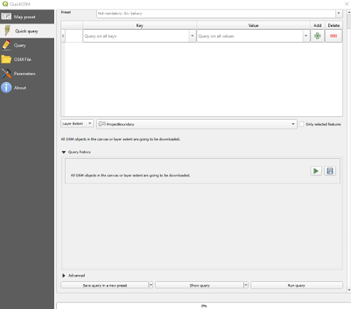
 
6.	When this is done, 4 layers should be added to your program. Two of them can already be deleted since we won’t use them. So, delete the Layer made of points and the line layer which only holds the major roads, which is the one with the least number of features, which you can find in the attribute table of the layer (right click the layer). Select these two and delete them right clicking and pressing Remove Layer…
7.	I recommend giving the two remaining layers correct names, the line layer represents the road network, and the polygon layer gives the land use. You can rename layers by selecting them and pressing the `F2` button. Or right click them and select Rename Layer.

###	Filtering the OSM data and exporting the road network to shapefiles
Now that the basic OSM data is collected, we will filter and adjust it in a way so we will only have the road network left.

1.	Open the attribute table of the land use layer by right clicking the layer and pressing `Open Attribute Table`. These layers store all the land uses and since parking spots are also part of the road network, we want to have these polygons as well. The rest will need to be deleted.
2.	In the attribute table the field amenity shows if a polygon is a parking spot, so we only want to select the features which have a parking amenity. To do that, in the attribute table press the Se-lect features using an expression button. 
 
3.	In the text editor on the left, type the following: `"amenity"= 'bicycle_parking' OR "amenity"= ‘parking'`. This selects all features where the amenity is either bicycle parking or normal parking. You can view values of a certain field in the middle part of the screen. Under Fields and Values, you can select any Field, then on the right press All Unique to display all possible values of the selected field. 

    
 
4.	In the bottom right, press the `Select Features` button and close the `Select by Expression` window.
5.	Now back into the main QGIS window, right click the land use layer, go to `Export -> Save Se-lected Features As…`

    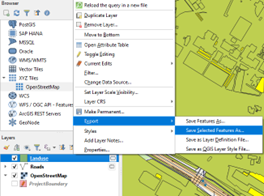
 
6.	Give the file a logical nam e (like parking), set the CRS to RD New and press the OK button. Again, if a transformation request appears, just press “OK”.

    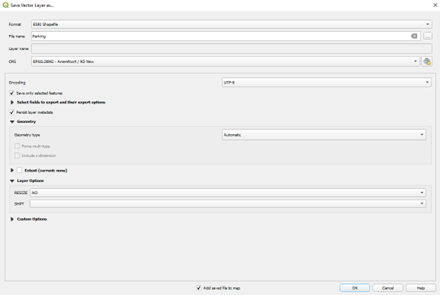
 
7.	A new layer with just the parking areas should now show up. Now you can delete the land use layer.
8.	Now the road network needs to be clipped using the project boundary layer you created before. So, in the toolbar navigate to `Vector -> Geoprocessing Tools -> Clip…`

    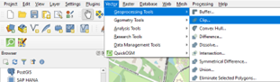
 
9.	Set the Input layer to the road network and the Overlay layer to the project boundary layer and press Run. A new layer called Clipped should now appear.
10.	Delete the unclipped roads layer and the project boundary layer and rename the clipped layer to something that makes more sense (like roads).
11.	You want to make the new road network layer permanent, which you normally do by right clicking and pressing `Make Permanent…` However, QGIS can only do that for layers that have less than 250 fields. Since the road network is imported from OSM, there are 300 fields. To fix this, we will delete at least 50 fields that do not hold important information. So right click the new road net-work, and press Properties… Within the properties, go to Fields and select the Field with id 1 till around the 75th by clicking the first and shift clicking the last. Then enable editing and press De-lete Field.

    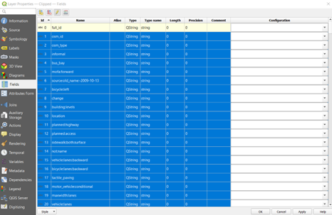
 
12.	Now press the `Add Field` button next to the delete field button. Set the name to Buffered. Lastly press Apply (might take a while) and close the window
13.	Now the road network only exists out of lines, and you want the roads to have a thickness, which you can give to them using a buffer. But since the OSM uses a different coordinate system, first the road network needs to be converted to RD new. Because if you use buffer with another co-ordinate system, the dimensions will not be correct. The easiest way to do this is by right click-ing the road layer and press `Export -> Save Features As…` Give it a logical file name and make sure that the CRS is set to RD new, then press OK. You can now delete the old road layer (you do not have to apply the changes).

    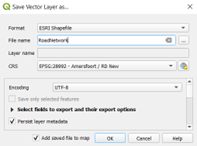
 
14.	Now the road network would be ready to have the buffer applied, however, not every road type has the same width. So, the width of a road will be decided by its attributes. The attributes of a feature can be found by pressing the Identify Features button in the Toolbar. Then click on one of the roads for example on the Hengelosestraat. To the right, you can see that features attrib-utes. At the bottom, you can see that this road has a maxspeed of 50 and is a primary road. We will select on those attributes.
 
15.	In the Attribute table of the road layer, select by expression and full in the previously decides at-tributes. The following code can be used: `"maxspeed" = '50' AND "highway" = 'primary' AND “Buffered” is NULL`. When you have pressed select features, you see that the entire Heng-elosestraat is selected.
16.	Now give the selection a width by using the buffer tool, which can be found at Vector -> Geo-processing Tools -> Buffer… Set the input as the road layer, check the `“Selected features only”` checkbox. Decide on a distance of the road, which should be half the total width you want it to be. You could for example use google earth to measure the distance on the satellite image. Also set the End cap style to flat and press run. Rename the output to something that makes sense to you. 

    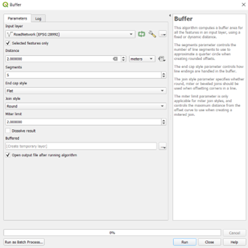
 
17.	After you have created the buffer for the road, return to the attribute table. Because now we will make clear which roads we already have created. So, click on the Field Calculator button.
 
18.	In the field calculator, check the Update existing field button and set it to the Buffered field. In the expression simply type 1. When you press OK, this will change the Buffered field for all your selected features to 1.
19.	Repeat steps 15 up and including 19 until your entire network is buffered. You can of course al-so make bigger selections. Please note that not all lines in the network must be buffered, for ex-ample waterways are also in the dataset. Before exporting, you could combine the different lay-ers in QGIS, but this is not strictly required.

    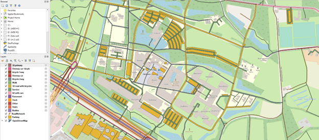
 
20.	You can save the layers as shapefiles in two ways: 1. make the layers permanent, that will save the shapefile to the location of your project. 2. you export it and save it elsewhere. I do recom-mend collecting all the shapefiles and put them in a folder. Do not forget the Parking layer. Also, not just the .shp files are required, so do not delete, or move the other files.

###	Importing and adjusting a shapefile in Blender

1.	Import the shapefiles using `GIS -> Import -> Shapefile (.shp)`. Navigate to where you saved the shapefiles of the road network, select one and press the `Import SHP` button. On the popup screen, just click OK. Do this for all shapefiles.
2.	All the layers should perfectly line up with each other if you have used the same export setting for each shapefile. Select all objects using `A` and press `tab` to enter edit mode. Again, make sure that everything is selected by using A.
3.	Now we will give some thickness to network since 3D programs work better with cubes than with planes. So, press `E` to extrude and click.
4.	In the bottom left corner, click on the `Extrude Region` and Move bar that pops up, this should open the extrude settings. Set the Z move to -0.3 to give the network a thickness of 0.3 meters.

    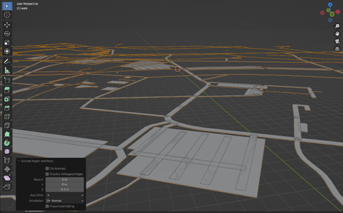
 
5.	Again, select everything and in the toolbar under UV, press `Smart UV Project` and press OK. This will make it easier to apply materials later in another program.

    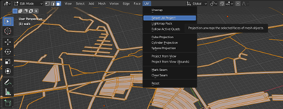
 
6.	Also, while you have everything selected recalculate the outsides using `Mesh -> Normals -> Re-calculate Outside`.

    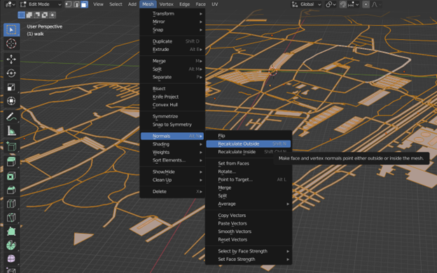
 
7.	Exit edit mode by pressing tab again. And export the network using `File -> Export -> FBX (.fbx)` set the Forward transform to X Forward and the Up to Z Up and press Export FXB when you have navigated to the place you want the file to be. Don’t forget to name your file.

