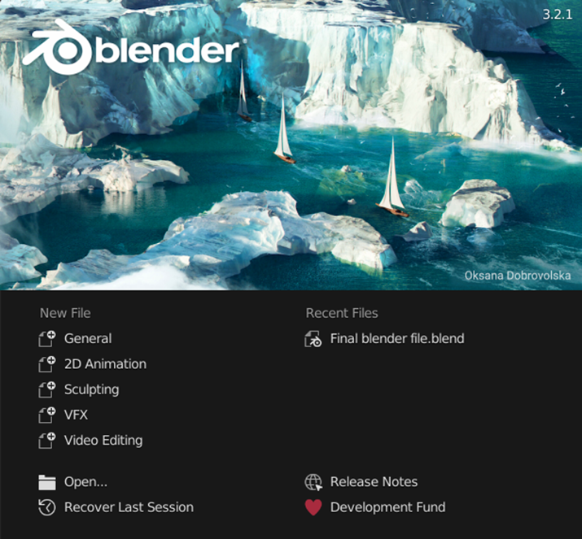
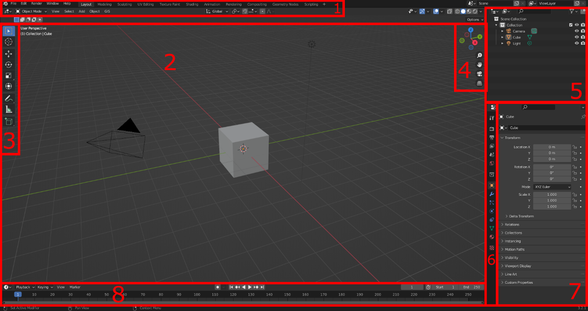

# Creating a 3D Building in Blender

**Author**: Dr. Mila Koeva and Guus Verweij  
**Date**: July 2022

<a property="dct:title" rel="cc:attributionURL" href="https://github.com/DigitalTwin-Geohub/DigitalTwinEducation/blob/main/docs/Assignment/Intro%20to%20blender.md">Creating a 3D Building in Blender</a> by <a rel="cc:attributionURL dct:creator" property="cc:attributionName" href="https://research.utwente.nl/en/persons/mila-koeva">Dr. Mila Koeva, Associate Professor of Digital Twinning, ITC, University of Twente, with contributions from Guus Verweij</a> is licensed under <a href="https://creativecommons.org/licenses/by-nc-nd/4.0/?ref=chooser-v1" target="_blank" rel="license noopener noreferrer" style="display:inline-block;">Creative Commons Attribution-NonCommercial-NoDerivatives 4.0 International</a>

## Overview

### Learning Aim
To use Blender to create a simple 3D building.

### Learning Objectives
- Exercise

### Expected Time Investment
- 3 hours

### Required Material & Data
- The final Blender file from the QGIS to Blender tutorial.
- Blender software.
- A mouse.

### Deliverables/Products
- No formal deliverable required.

### Assessment and Feedback
- No formal assessment. You can talk with the teacher for feedback.

---

## Installing and Getting to Know Blender
The building data for the campus is still in three different files and to ease future use, they need to be combined. This will be done in Blender. If you have already done this, you can skip this chapter.

1. Go to [Blender Download Page](https://www.blender.org/download/) and download and install Blender.
2. Start Blender, and in the start-up screen, click “General” under “New File.”
   

3.	Now you have entered the default screen, which is explained below:

    1.	The toolbar, in the upper left part, you can find your save, load, import, export, options and help buttons. In the upper right part, you can choose a screen layout, different pre-sets for different workflows are already there. For this tutorial, we will only use the “Layout” button. 
    2.	The viewport, moving around in this viewport is very similar to other 3D programs. You use the scroll wheel to zoom in and out. Press the middle mouse button and move the mouse to pan the camera around. Shift+ middle mouse button moves the camera. You select an object with the left mouse button, and you open the options menu using the right mouse button (you can swap this around in Edit -> Preferences… -> Keymap).
    3.	Quick tools bar, some often used tools are in this area, like scale, rotate and move.
    4.	Camera controls, if you forgot the camera controls or if you do not have a mouse, you can use these buttons to move around in the viewport. You can do this by click, hold, and drag mouse at the sphere with coordinate symbols.
    5.	The scene collection shows all the objects in the scene, you can also use this to select those objects instead of clicking on them in the viewport.
    6.	Properties bar, here you can select different properties
    7.	The properties that you have selected in 6. will show up here.
    8.	The timeline, often used for animation. But this will not be used in this tutorial.

4.	Practice with moving around in the viewport.
5.	Delete everyting that is in the current scene, do this by selecting the Camera, Cube and, Light either in the viewport or in the scene collection by holding “ctrl”, and clicking the “del” or “X” button on your keyboard, or by right clicking in the viewport and clicking the “Delete” button.

### Blender Default Screen
- **Toolbar**: Upper left part with save, load, import, export, and help options.
- **Viewport**: Move around by zooming with the scroll wheel and rotating the camera by pressing the middle mouse button. Shift + middle mouse moves the camera. Select an object with the left mouse button, and open options using the right mouse button.
- **Scene Collection**: Shows all the objects in the scene.
- **Properties Bar**: Displays properties of selected objects.
- **Timeline**: Primarily used for animation, not in this tutorial.

**Practice**: Get familiar with moving around the viewport, delete everything in the scene (Camera, Cube, Light) using the viewport or scene collection.

---

## Basic Modelling Tools in Blender
In this chapter, some basic modelling tools will be explained. These basic tools will later be used to make a building.

1.	Create a new general blender file and delete the Camera and Light by selecting them either in the viewport or in the Scene Collection and pressing the `X` or `Del` button. 
2. Select multiple objects in the viewport by holding `shift` and in the Scene Collection by holding `ctrl`.
3. Modelling in Blender is done in the Edit Mode, so select the existing cube and press the `Tab` button to enter the Edit Mode. Additionally, you can just press the “Modelling” tab in the toolbar.

---
### Subdivide
1. Create a new Blender file, delete the Camera and Light, and select the default cube.
2. 3D models exist out of three things, vertexes, edges, and faces. Vertexes are points, edges connect vertexes and faces connect edges. Each of these can be selected in the edit mode. In the toolbar you can select which you want to enable. Set the select mode to Face. 

    

3. Select any of the faces of the cube, `right click` and press “Subdivide”. This spits the selected face into 4. You can also use this on an edge to split it in two. 

    

4. Undo the action by pressing `ctrl+Z`. So, you once again have the default cube.
5.	Selecting multiple objects in blender can be done using `shift` and `ctrl`. For `shift`, it only selects the thing you clicked, when using `ctrl`, it finds the shortest path between your previous selected part and the part you just clicked on. Set the select mode to edge and select two opposing edges by holding `shift`.

6.	Press subdivide and see that the two selected edges are now split, and the newly created ver-texes are connected, which essentially splits the face in half.

     --> Subdivide --> 

7. When you have pressed the subdivide button, a small bar with “Subdivide” in it pops up, you can expand this box by clicking on it. These are the settings of the subdivide you have just applied, and you can change them here and immediately see the result in the model. The thing you will use the most is the Number of Cuts; this practically decides in how many parts you want to sub-divide the selected object into. You can experiment with the other setting yourself and see the results.

    

---
### Loop Cuts
Once again, start with the default cube either by undoing or by creating a new one and make sure you are in edit mode.
1. Select the loop cut tool either by pressing `Ctrl+R` or by pressing it in the quick toolbar.
2. If you now hover over the cube, you can see a yellow line indicating where the tool will cut the model. If the yellow line is where you want to add the cut, press the left mouse button to apply the tool.

    

3. Once again, in the bottom left, a menu bar pops up which you can expand to change the settings of the tool. For example, the number of cuts can be determined here.
4. While this tool might seem similar to the subdivide surface, the difference is that the loop cut creates a closed loop which can be very important for a model’s topology. A model’s topology is important if you want to be able to easily adjust the model later, give materials/textures to the model, and especially when you want to animate a model. Therefore, use the loop cut as often as possible.

### Inset, Extrude, and Bevel
1. Once again, start with the default cube in edit mode.
2. Select a face and press `I` or the Inset Faces button on the quick toolbar (two spots above the loop cuts button).
3. If you have pressed `I`, move your mouse around and see that you inset the selected face. Left-click in the viewport to confirm the inset. If you have used the Inset Faces button, you have to click and hold the yellow circle and then move around your mouse. Let go of the mouse to confirm your inset.
4. In the bottom left, you can again expand the settings of the tool. Here you can exactly change, for example, the thickness of the inset.

    

5. With the inner face of the inset selected, press `E` or press the Extrude Region button (one spot above the inset button).
6. When you’ve pressed `E`, move the mouse around and see that you are extruding the selection. Click when you are happy with your extrusion.
7. With the same face selected, press the Bevel button (one spot above the loop cut button) or press `Ctrl+B`.
8. The most important settings are the width and segments settings, so experiment with them to see what they do. Do not use too many segments because they add a lot of geometry to the model, which requires more computational power.

    

9.	With the same face selected, press the Bevel button (one spot above the loop cut button) or press ctrl+B.
10.	Using ctrl+B, just click once and open the tool settings tab. For using the Bevel button, press and hold the yellow circle and move it around a bit and stop holding it. This should also open the settings tab.
11.	The most important settings are the width and segments settings, experiment with them to see what they do. Do not use to many segments, because they add a lot of geometry to the model, which requires more computational power.

---
### Other
1.	You can move, rotate, and scale vertexes, edges, and faces by using the corresponding buttons in the quick toolbar
 
    

2.	You can select a loop of vertexes, edges, or faces by holding the alt key when selecting one of those
3.	You can move vertexes, edges, or faces along an(other) face by pressing shift+V and moving your mouse around.
4.	The spin tool (three spots under the loop cut) can be of great use to make for example roads.

## Assigning Materials to an Object

Now you pose the required basic modelling tools to create a building in Blender. However, before the modelling will start, object materials will be explained. You start this chapter with the default scene, where you can delete the camera and light.
1.	In the end, you want your building to have different materials, roofs should look different than for example glass or walls. When in edit mode of an object, the last tab in the properties bar is the material properties.

    

2.	There is only one default material that is assigned to all the faces of the object. You can rename it by double clicking the name and you can change the base colour by clicking the correspond-ing bar. By default, you won’t see this colour change, to see it change the viewport shading to material preview. You can do this in the upper right part of the viewport.

    

3.	Now add a new material by pressing + sign in the material properties, then immediately press the + New button that shows up. You delete a material by selecting it and pressing the – button, this can only be done outside of edit mode.

    

4.	Give the new material a colour different from the first material. To do that, make sure you have selected the correct material by simply clicking on it in the list of the material properties tab.
5.	Currently all the faces of the cube have the same material assigned, to change this, select a face of the cube, in the material list, click on the material you want to assign to the selection, and press Assign. The assign button assigns the selected material to your selection in the viewport. If you want to select all the faces with a certain material, you can use the Select button next to the Assign button.

    

6.	At the end of your modelling phase, but before exporting, you always have to check if your normals are all facing the correct way. Normals shows the program on which side of the face the material should be, so if you do not have them all facing the same way, some faces will be see-through. To check this, open the overlay settings menu in the upper right part of the viewport and enable the “Face Orientation” checkbox. Tip: in these settings you can also enable edge length and face area settings, this allows you to see the measurements of selected faces and edges.

    

7.	All sides of the cube should now show as the same colour. The sides that are visible from out-side should be blue. In more complex models, that may not always be the case, there are multi-ple ways to fix this. All are accessible in the normal menu, which you can access using alt+N, or in the toolbar using Mesh -> Normals. You should always be in edit mode when changing nor-mals.
    * With all faces selected, press “Recalculate Outside”
    * With the wrong facing faces selected, press “Flip”
8.	Now that all your faces are facing the same way, the object must be setup in a way that complex materials with textures can be put on the model in blender or future programs. This is done in most programs using UV mapping, in simple terms, it is how a flat texture can be applied to a 3d model. You do that by cutting the model in a way that it can be made flat. Then the texture is applied by simply layering it on the flat model and then the model is folded back into its original shape. The UV map is the 2D representation of the model. For a basic cube, the UV map can be seen below. More information about UV unwrapping can be found online for example at: https://docs.blender.org/manual/en/latest/editors/uv/introduction.html 

    

9.	Blender has a separate UV Editing tab, so select that in the toolbar, make sure that the object is in edit mode and have all faces selected (use A). The UV map will then show up on the left part of your screen. For a simple cube, blender already has the correct UV map, but if you for exam-ple change the model, using the methods of chapter 3, the UV map will no longer be correct. The dimensions will no longer be correct. You can fix this manually, which is not part of this tutorial, but information can be found at: https://docs.blender.org/manual/en/2.79/editors/uv_image/uv/editing/unwrapping/seams.html. We will let blender to the work, so make sure all faces are selected, and in the toolbar select UV -> Smart UV Project and press Ok. Below, you can see the difference.

    

    , 
---
## 5.	Creating a building using basic modelling tools in Blender
In this chapter, you will use the output blender file from the QGIS to Blender tutorial and use that founda-tion to create a building. You are expected to use the methods discussed in the previous two tutorials to do this. This chapter will not be a step-by-step tutorial, instead I implore you to be creative and experi-ment with modelling the building. If you are stuck, look at this chapter as a guide and use it as inspira-tion.
1.	Since the building is now 2D, you first want to add height to the building. So, select the building object, enter edit mode, select all faces, and extrude it up. You can use the extrude settings to precisely decide on the height of a floor since it is easiest to do this for each floor. So, if you want a floor to be 4 meters high, you set the Move Z to (-)4. Extrude it by 4 meters for as many floors as you want. 

    

2.	You could also only extrude certain parts of the model to create some parts of the buildings that are higher than others to add some more interesting parts to the building. Since you can only ex-trude complete faces, you might want to add some loop cuts and move them around to create smaller faces to add a floor to. Tip: if you want to see the lengths of the edges enable them in the overlay settings.

    
 
3.	Since the water must leave the inside, the bottom floor of that level must be deleted. To do that, select the face at the underside of the building, extrude them up by the height of your floors and in the extrude settings, enable “Dissolve Orthogonal Edges” to have Blender automatically delete the “floating” walls. If that doesn’t do the trick, you can manually delete the faces by selecting the bottom edge and deleting it. Don’t forget that you can move the camera to your selection by pressing “.” on the numpad or in the toolbar press View -> Frame Selected.

    
 
4.	This method can generate some double vertexes; therefore, it is wise to often merge the vertex-es that overlap. This can be done by selecting everything using A, pressing M and select By Dis-tance, this tool merges all vertexes that are within a certain distance. In the settings tab that pops us, make sure that the Merge Distance is not too large since this will merge vertexes that you do not want to merge.
5.	Now would be a good time to assign the first materials, to give yourself an easier job, make sure that you colour each material differently

    
 
6.	Let’s now add windows, you can do this by selecting only the horizontal edges of a side and subdivide it as many times as you like. To make it yourself easier, already apply a new material to your selection. This way you will have a separate material for the frames of the windows. To do this afterwards takes a lot of time. Then inset the new windows, enable the “Individual” setting and assign the selection to a new material for glass. Depth greatly enhances a model, so you can add depth to the model by extruding certain parts, for example, set the glass a bit back. Do this for all sides where you want windows or doors. Try to vary with materials, think about this in advance.

    
 
7.	Now that the basic building is done, you can add additional details like an entrance etc.

    
 
8.	When you have finished your building, do not forget to check if all the faces are orientated cor-rectly and use smart UV unwrap to correct the UV’s. Also remove excessive vertexes using merge by distance.
9.	Now the building can be exported, you can export to many file types, but the programs you will use the FXB format. Export the building by selecting the object and go to File -> Export -> FBX (.fbx). Check the “Selected Objects” box, under transform set the Forward to X Forward, and the Up to Z Up and hit the Export FBX button.

    

---
