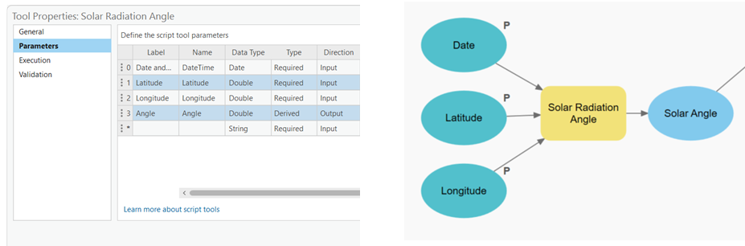

<p style="text-align: right" ></p>

This tutorial is an adaptation of the work published in by [Cárdenas-León et al.](https://isprs-annals.copernicus.org/articles/X-4-2024/67/2024/) and the [Digital Twins for PET Calculation Tutorial] (https://github.com/ivan-cardenas/PET-DigitalTwins/tree/main)

*Online Tool*
You can access the working online tool [here](https://utwente.maps.arcgis.com/apps/webappviewer/index.html?id=ca1f19d5ecfb4820a5d1c0ae31d61563) 


We also provide with a [video](https://youtu.be/WjoYRjI_w9w) on how to use this online tool. 

---

Please cite this work

### BibTeX

```
@misc{cardenas_ivan_l_2023_8306385,
  author       = {Cárdenas, Ivan L. and
                  Morales, Luis Rodrigoandrés and
                  Koeva, Mila and
                  Atun, Funda and
                  Pfeffer, Karin},
  title        = {{Digital Twins for Physiological Equivalent 
                   Temperature Calculation Guide}},
  month        = aug,
  year         = 2023,
  publisher    = {Zenodo},
  version      = {v1.0},
  doi          = {10.5281/zenodo.8306456},
  url          = {https://doi.org/10.5281/zenodo.8306456}
}
```
---
## Introduction
As urbanization and climate change reshape our environments, the need to assess and improve thermal comfort has become increasingly urgent. Physiological Equivalent Temperature (PET) is a valuable biometeorological metric that quantifies the combined effects of air temperature, humidity, wind speed, and solar radiation on human thermal perception. This integrated approach helps urban planners, architects, and environmental scientists create spaces that enhance human comfort and well-being.

This guide is designed to help users—whether beginners or seasoned professionals—leverage ArcGIS Pro and Python for accurate PET calculations. It covers the theoretical background of PET, explains its importance, and provides practical, step-by-step instructions for generating PET maps and analyses using these tools.

The following sections explore PET's theoretical basis and its role in understanding human-environment interactions. We also introduce the fundamentals of ArcGIS Pro, focusing on its geospatial data capabilities and spatial analysis tools. By combining theory with hands-on applications, this guide equips researchers, practitioners, and students with the skills to compute PET and design thermally comfortable urban environments effectively.

## What You Will Need

Before getting started with the guide, make sure you have the following:

### A computer with access to the internet.

### ArcGIS Pro: 

Ensure that you have ArcGIS Pro installed on your computer. 

### ArcGIS Pro License: 

You will need a valid license to use ArcGIS Pro. If you don't have a license, you can obtain one through Esri or check if you have access to ArcGIS Pro through your organization or educational institution.

### Physiological Equivalent Temperature (PET) Algorithm: 

Understand the concept and principles behind the Physiological Equivalent Temperature (PET) calculation. Familiarize yourself with the algorithm or method used to calculate PET in ArcGIS Pro. You can check [Section 2](): Understanding the Science Behind PET.

###	GIS Data: 
To perform the PET calculation, you will need the necessary GIS data layers. These may include a digital elevation model (DEM), land cover data, meteorological data (such as temperature, humidity, wind speed), and any other relevant spatial data required for the analysis. Ensure that you have the required data or access to it. You can see a detailed list and how to obtain each individual data in [Chapter 2: Data Sources and Project Preparation for PET Calculation]()

# Section 2: Understanding the Science Behind PET
Understanding PET requires some basic knowledge of the science behind it. Don't worry—we’ll break down the concepts so they’re easy to follow. Below are the key terms and ideas you'll encounter:

What is Physiological Equivalent Temperature (PET)?
PET is a numerical value that combines variables like temperature, humidity, wind speed, and solar radiation to estimate perceived thermal comfort. It helps us understand how weather conditions affect the human body.

The PET model was developed to standardize urban heat maps, especially for climate stress tests in places like the Netherlands. These tests evaluate the effects of heat stress on infrastructure and society. Before PET, heat maps varied widely due to inconsistent methods and metrics. PET now provides a consistent way to identify hotspots and inform climate adaptation strategies.

Using meteorological models and GIS tools, PET integrates data such as weather, urban layouts, and the urban heat island effect to produce detailed heat maps. It accounts for variables beyond air temperature, such as wind, humidity, and radiation, which significantly impact how humans experience heat. PET has been validated in studies and includes projections for future climate scenarios, making it a powerful tool for urban planning and decision-making.

The formula proposed by Koopmans et al. is:

𝑃𝐸𝑇𝑠𝑢𝑛 = −13.26 + 1.25𝑇𝑎 + 0.011𝑄𝑠 − 3.37 𝑙𝑛(𝑢1.2 ) + 0.078𝑇𝑤 + 0.0055𝑄𝑠 𝑙𝑛(𝑢1.2) +5.56 𝑠𝑖𝑛(𝜑) − 0.0103𝑄𝑠 𝑙𝑛(𝑢1.2 ) 𝑠𝑖𝑛(𝜑) + 0.54Bb + 1.94𝑆𝑣f

Key Variables in PET
1. Temperature (Ta)
Measures how hot or cold the air is, typically in degrees Celsius (°C). Urban air temperature plays a significant role in thermal comfort.

2. Humidity (φ)
Represents the amount of moisture in the air. High humidity makes it feel hotter, while low humidity makes it feel cooler.

3. Wind Speed (u₁.₂)
Measures how fast air is moving, usually expressed in meters per second (m/s). Wind speed affects how heat dissipates from the body.

4. Solar Radiation (Qs)
Refers to the energy emitted by the Sun. This influences temperature, weather patterns, and thermal comfort.

5. Solar Elevation Angle (φ)
Indicates the Sun's height above the horizon, changing throughout the day and year. It affects the intensity of solar radiation.

6. Sky View Factor (Svf)
Measures how much of the sky is visible from a given point. Areas with more visible sky (Svf closer to 1) receive more direct sunlight, while obstructed areas (Svf closer to 0) stay cooler.

7. Bowen Ratio (Bb)
Describes the balance between heat transferred through warming air (sensible heat) and evaporating moisture (latent heat). A high ratio means more heat is warming the air directly.

8. Wet Bulb Temperature (Tw)
The lowest temperature achievable through evaporative cooling, measured using a wet cloth on a thermometer. It reflects the cooling effect of evaporation on human skin.

9. NDVI (Normalized Difference Vegetation Index)
A measure of vegetation health derived from satellite data. Healthy vegetation absorbs red light and reflects near-infrared light, helping reduce local temperatures.

## Chapter 2
### Section 1: Exploring Data Sources

To calculate PET accurately, we need reliable data on temperature, humidity, and land cover. Luckily, there are various sources available that provide such information. According to the proposed method by (Koopmans et al.) the warmest day of the past five years should be considered to gather all the necessary data. 

After doing some research in the area of **Enschede, Netherlands** it was determined that the warmest day was July 27, 2019. Here's an overview of some commonly used data sources:
####	1. Meteorological Stations: 

Local weather stations provide temperature and humidity data. You can usually obtain this data from meteorological agencies or research institutions. Make sure to gather data for the desired study period and location.

   a.	In the Netherlands the Dutch Weather data from KNMI is available and accessible online as an open source data.

   b.	Knmy is a Python package for downloading and processing weather data from the automated weather stations of the Dutch Meteorological Institute (KNMI). Documentation of the used API can be found here (only in Dutch). https://knmy.readthedocs.io/en/latest/

   c.	For a list of the available selectable parameters and weather stations in the Netherlands to be used in the knmy wrapper you can also visit https://daggegevens.knmi.nl/.

d.	The closest Station in Enschede is the number 290: Twente.

e.	In order to find the warmest value of the day, we need to specify that we will obtain the values by hour (‘hourly’) and a range within the selected day. 

f.	Values like Temperature, Humidity, Solar Radiation were obtained using [this method](Assets/Meteorological.py).

#### 2.	Remote Sensing Data: 

a.	The NDVI raster was obtained using a google earth engine code for the area of the city of Enschede.

b.	After identifying the date with the highest temperature in the last 5 years, we will obtain the median NDVI values for the months where the highest temperature was recorded.

c.	In the website https://earthengine.google.com/ you can access the Google Earth Engine editor by clicking the Platform button on the top of the site and clicking on Code Editor.

d.	 Log-in with a compatible account (any google account can be used).

e.	Paste the [following code](Assets/NDVI.js) in the editor.

f.	Add a polygon geometry on the map that contains the area that you want to obtain the NDVI from by selecting the rectangular geometry tool .

g.	The default name of this area will be called ‘geometry’, use this name and replace it instead of the text “path to asset” (the name geometry goes without any additional ‘ or “).

h.	Execute the code by clicking the ‘Run’ button on the top menu of the editor.

i.	This will generate a new tasks in the ‘Tasks’ tab beside the editor. This task will be named NDVI, when you press it, it will prompt you to provide basic information to generate the NDVI and the storage location.

j.	Fill in the CRS (Coordinate Reference System) in which you want the output to be generated (in our case as we were working in The Netherlands, we choose EPSG:28992).

k.	Save the file as a Geo_TIFF in order to retain the coordinate system data.

---
Now you have your own NDVI for your study area!

#### 4. Trees

a.	In our case, we had access to the tree shapes files from the Municipality of Enschede, this files are a bit more accurate but  not public. You can still find tree shapefiles by visiting https://www.openstreetmap.org/ and clicking the button Export in the top menu.


b.	Select the desired area to be exported and click the button ‘Export’, if the area is within the allowed size limitations from OpenStreetMap’s you can save the .OSM file in your computer.

c.	This file can be loaded in to a large variety of GIS software including ArcGIS and QGIS, you can load them and do a selection by expression to isolate the trees in a new layer.

d.	ArcGIS Pro does not natively support the .osm file format in the Catalog pane. However, you can use the ArcGIS Editor for OpenStreetMap (OSM) extension to import and work with .osm files in ArcGIS Pro. Here's how you can do it:

*	Install the ArcGIS Editor for OpenStreetMap extension for ArcGIS Pro. You can download it from the Esri website.
*	Launch ArcGIS Pro and open your project.
*	Go to the "Insert" tab in the top menu and click on "Add-In" in the "Extensions" group.
*	Select "ArcGIS Editor for OpenStreetMap" from the list of extensions. This will enable the OpenStreetMap toolbar.
*	Click on the "Open OpenStreetMap Toolbox" button on the OpenStreetMap toolbar. This will open the OpenStreetMap toolbox.
*	In the toolbox, expand the "Import" toolset and select the "Load OSM File" tool.
*	Specify the .osm file you want to load and choose the output feature dataset or geodatabase where you want to store the imported data.
*	Configure any additional options, such as coordinate system and tag filtering, as needed.
*	Click "Run" to import the .osm file into ArcGIS Pro using the Editor for OpenStreetMap extension.
e.	Once the .osm file is imported, you can proceed with selecting the tree points and saving them in a new layer:
*	In the Contents pane, right-click on the imported .osm layer and select "Attribute Table" to open the attribute table.

f.	In the attribute table, identify the field that represents the tree points. It may be labeled as "leaf_type"=>"broadleaved","natural"=>"tree".
*	Use the "Select by Attributes" tool in the Selection group on the Map tab to select the tree points based on their attributes or spatial relationship.
*	Once the tree points are selected, right-click on the layer in the Contents pane and choose "Data" > "Export Features." This will open the "Export Features" geoprocessing tool.
*	Specify the output location and name for the new layer that will contain only the selected tree points.
*	Click "Run" to save the selected tree points as a new layer.

**g.	Alternatively you can also use QGIS to separate the tree points from the .OSM into a new point shapefile without the need of an external plugin.**

#### 5. Water Bodies
For this you can use an [overpass-turbo code](Assets/WaterBodies.sql) to obtain the Water Bodies OSM polygon shapefile inside the city of Enschede. 

This code is written in Overpass QL, which is used with the Overpass API for querying OpenStreetMap data. To run this code and obtain the result, you can use the Overpass Turbo web application.

 a.	Visit the Overpass Turbo website: https://overpass-turbo.eu/ 

b.	Copy the code into the text editor on the left side of the Overpass Turbo interface.

c.	You can choose to edit the geocodeArea to the name of the city you are interested in getting the data from. (In other words, this is how you change the city you want to search inside of).

d.	Click the "Run" button (or press Ctrl+Enter) to execute the query.

e.	The results will be displayed on the map on the right side of the interface, and a list of elements will be shown below the text editor.

To use the result as a layer in ArcGIS Pro, you can export the data from Overpass Turbo and import it into ArcGIS Pro using one of the following methods:


##### Export as GeoJSON:
a.	In Overpass Turbo, click the "Export" button located above the map.
b.	Select "GeoJSON" as the export format.
c.	Save the GeoJSON file to your local drive.

##### In ArcGIS Pro:
a.	Open ArcGIS Pro and create a new project or open an existing one.
b.	In the Catalog pane, navigate to the location where you saved the exported GeoJSON file.
c.	Right-click on the folder or geodatabase where you want to import the data and select "Import" > "File Geodatabase" or "Feature Class."
d.	Follow the prompts to import the GeoJSON file into ArcGIS Pro. 

#### 6. Building Footprints

a.	Through the National Provision for Key Register Addresses and Buildings. You can obtain the building footprints for all of The Netherlands. The BAG 2.0 Extract contains the Basisregistratie Adressen en Gebouwen (BAG) data that is available free of charge. On the 8th day of every month, a new Extract with the current data is created

b.	You can download the files from the open website https://www.kadaster.nl/-/kosteloze-download-bag-2.0-extract  these are way easier to download. 

#### 7. Digital Surface Model (DSM)

The DSM represents the Earth's surface including all above-ground features like buildings, trees, and other structures. It captures the elevations of these features, resulting in a surface that includes both the bare ground and the objects on it.

The AHN4 0.5 meter raw grid (DSM) is intended as a raw file, where both ground level and non-ground level objects (trees, buildings, bridges and other objects) have been resampled from the point cloud into a 0.5 meter grid. No further edits have been made. For the Netherlands access the  Actueel Hoogtebestand Nederland 4  (AHN 4) data repository where the Digital Surface Model (DSM) and Digital Terrain Model (DTM)  files for your study area are available: 
https://www.arcgis.com/apps/Embed/index.html?appid=73433bc06f7640949f32e4f8e3842e7a 

Locate and download the DSM files for your desired study area in a suitable format. The DSM is available at a scale resolution of 0.5m and 5m. Be careful, as the lower the number in the resolution the bigger the file will be when you download it, and the longer it will take to process once you use it later on. If you consider you computer is not fast enough try downloading the 5m resolution instead.  Make sure the files cover the same spatial extent as the DTM.

#### 8. Digital Terrain Model (DTM):

The DTM represents the bare ground surface without any above-ground features. It eliminates the heights of objects like buildings and trees, focusing solely on the natural topography of the terrain.

The AHN4 0.5 meter ground level grid (DTM) is intended as a ground level file, with all non-ground level objects (trees, buildings, bridges and other objects) removed from the point cloud. For the Netherlands, access the  Actueel Hoogtebestand Nederland 4  (AHN 4) data repository where the Digital Terrain Model (DTM)  files for your study area are available: 
https://www.arcgis.com/apps/Embed/index.html?appid=73433bc06f7640949f32e4f8e3842e7a 

Locate and download the DTM files for your desired study area in a suitable format. DTM is available at a scale resolution of 0.5m and 5m. Be careful, as the lower the number in the resolution the bigger the file will be when you download it, and the longer it will take to process once you use it later on. If you consider you computer is not fast enough try downloading the 5m resolution instead. Make sure the files you download cover the same spatial extent as the DSM .

#### 9. Digital Elevation Model (DEM):

A Digital Elevation Model (DEM) is a digital representation of the Earth's surface, which provides information about the elevation or height of the terrain at different locations. It is a widely used dataset in various fields, including geospatial analysis, hydrology, and terrain visualization. By subtracting the DTM from the DSM, we obtain the DEM, which represents the bare ground elevation at each location. This process helps in removing the influence of above-ground features and isolating the terrain's natural elevation. 
So, now that you have collected the DSM and the DTM raster files, you will be able to use them pretty early in the data collecting phase. Here is a step-by-step guide on how to obtain a Digital Elevation Model (DEM) using the Digital Surface Model (DSM) and the Digital Terrain Model (DTM) in ArcGIS Pro using the Raster Calculator:

a.	Start ArcGIS Pro and open your project.

b.	If you haven’t done it already, add both the DSM and DTM rasters to your project by navigating to the "Catalog" pane, locating the folder containing the rasters, and dragging them into your map or right-clicking and selecting "Add to Current Map."

c.	Once the DSM and DTM rasters are added, navigate to the "Analysis" tab in the top menu and click on "Tools" to open the Geoprocessing pane.

d.	In the Geoprocessing pane, type "Raster Calculator" in the search box to locate the "Raster Calculator" tool. Click on it to open the tool.

e.	In the Raster Calculator tool, you'll see two input boxes. In the first input box, enter the DSM raster name or drag and drop it from the "Catalog" pane. 

f.	In the second input box, enter the DTM raster name or drag and drop it from the "Catalog" pane.

g.	To perform the calculation, subtract the DTM from the DSM. You can do this by typing the following expression in the Raster Calculator tool:  DSM - DTM

h.	Choose a destination folder and specify a name for the output raster. You can do this by clicking on the "Browse" button next to the "Output raster" parameter and navigating to the desired location.

i.	Click on the "Run" button to execute the Raster Calculator tool.

j.	Once the tool completes, the resulting DEM raster will be saved in the specified output location. You can add this DEM raster to your map by dragging and dropping it from the "Catalog" pane or by right-clicking on the map and selecting "Add Data."

#### 10. Solar Angle

[This code](Assets/SolarAngle.py) has to be added into ArcGIS PRO as a toolbox that will accept inputs. This inputs will let the code work and you will have a nice tool to load every time you need to obtain this value. This tool will also be useful later as it will be possible to add it into a model builder when we use all the values to calculate the PET.

Arcpy code to be loaded in a compatible environment like in an ArcGIS PRO toolbox. Here is how to add the code to a toolbox in ArcGIS Pro and configure the necessary parameters:

a.	Open ArcGIS Pro and create a new project or open an existing one.

b.	In the Catalog pane, right-click on "Toolboxes" and select "Add Toolbox". Give the toolbox a name and save it in a desired location.

c.	Right-click on the newly created toolbox and select "Add Script".

d.	In the "Add Script" window, provide a name for the script and select the Python script file containing the code you provided.

e.	Click "Next" to proceed to the "Script Properties" window.

f.	In the "Script Properties" window, you can configure various settings for the script:

*	**Label**: Provide a label for the script.
*	**Description**: Enter a description that explains the functionality of the script.
*	**Script File**: Specify the path to the Python script file containing the code.
*	**Toolbox Alias**: Optionally, you can provide an alias for the toolbox.

g.	In the "Parameters" tab, you can add the necessary input parameters:

*	Click on the "Add" button to add a new parameter.
*	Specify a name for the parameter.
*	Choose the appropriate data type for the parameter (e.g., Date, Double, String).
*	Optionally, you can provide a label, direction, and default value for the parameter.
*	Repeat these steps to add all the required parameters (`when_full`, `latitude`, `longitude`, `solar_angle`).

h.	After adding the parameters, you can configure additional settings as needed, such as parameter validation, dependency between parameters, and tooltips.

i.	Click "Finish" to add the script to the toolbox.

j.	You can now find the script tool under the toolbox in the Catalog pane. Double-click on the script tool to open the tool dialog.

k.	In the tool dialog, you can enter values for the input parameters (`when_full`, `latitude`, `longitude`, `solar_angle`).

l.	Click "Run" to execute the script with the provided input values.

#### 11. Wind Speed

In order to obtain this value, the preferred way would be to have some sensors around the city that are located at a proper height (the wind speed on top of buildings is not the same as the one at street level). As this data was not available neither in raster nor shapefile format at the moment we worked in the project, we had to use a simulation software in order to obtain an approximation on how the wind was behaving on the day of the warmest temperature in our study area. If you happen to have access this data from measuring sensors you can also opt to generate a raster through the interpolation of the sensors data (the interpolation process will be also shown in these steps).

WindNinja is a reliable simulation tool for wind that uses computational fluid dynamics (CFD) to model and predict wind flow patterns. It was developed by the Missoula Fire Sciences Laboratory, which is part of the Rocky Mountain Research Station, U.S. Forest Service.

WindNinja is trusted by researchers, scientists, and professionals in various fields, including wildfire management, emergency response planning, and wind energy assessment. It incorporates high-resolution terrain data, atmospheric boundary layer physics, and meteorological input to generate accurate wind simulations.

By considering factors such as topography, land cover, and weather conditions, WindNinja can estimate wind speed, direction, and turbulence at different heights above the ground. This information is valuable for assessing wind patterns, understanding airflow behaviour, and making informed decisions related to fire behaviour, smoke dispersion, air quality, and wind energy site selection.

WindNinja's credibility comes from its continuous development, rigorous testing, and validation against field measurements and other established wind models. Its open-source nature allows for community contributions and ongoing improvement, making it a trusted tool for wind modelling and analysis
Based on the values we got from the meteorological station for wind on the warmest day in Enschede,  we calculated the wind speed at 1.2m from the ground using a 100 azimuthal angle on a specific date (July 27, 2019), if you want to obtain your own value you can try the following steps:
	
##### Step 1. Wind Speed (Point Shapefile):

1.	Download and install WindNinja:  This is a standalone open-source software that can be downloaded from the following website (https://www.firelab.org/project/windninja).

2.	Launch WindNinja: Launch the application after installing it.

3.	Import terrain data: You need to provide terrain data for the specific location you are interested in. You can import the terrain data in one of the following ways:

*	Load a digital elevation model (DEM) file: You can import a DEM file (e.g., in GeoTIFF format) that covers your study area. (This is the method we used).
*	Use online data sources: WindNinja allows you to fetch terrain data from online sources such as the National Elevation Dataset (NED) or the Shuttle Radar Topography Mission (SRTM).

4.	Set the date: In the WindNinja interface, navigate to the "Weather" or "Initialization" tab (depending on the version) and specify the desired date (July 27, 2019) as the simulation date.

5.	Define the desired output height: In WindNinja, you can set the output height to 1.2m to obtain the wind speed at that specific height and the speed should be set to m/s. This option is typically found in the “Wind Input" tab.


6.	Set the azimuthal angle: you can (and should) also define the azimuthal angle to simulate wind from a specific direction. In this case, set the azimuthal angle to the angle obtained from the meteorological station (for us it was 100 degrees angle) to obtain wind information from that direction. This is also done in the Wind Input tab.

7.	Configure the Output parameters: You can turn on the checkbox for the shapefile result. This will allow you to export the result as a .SHP file that you can load in any GIS software. You can use the mesh resolution to try to keep the data as compatible as possible. 


8.	Run the simulation: Once you have set all the desired parameters, you can go to the “Solve” tab, where you can indicate the folder where you want to save the resulting point feature (.SHP) and the amount of cores you want to use from your computer to process this task (more cores translate into faster calculation times, but this is limited to the hardware of your computer).

9.	In the same tab, initiate the simulation by clicking the "Solve" button. WindNinja will perform the calculations and generate the wind results for the specified date, output height, and azimuthal angle. (This could take a long time to process depending on your computer specs and the resolution of the DEM you used as an input. If it takes to long to process you can try generating a DEM with a resolution of 5m instead of 0.5m).

10.	Analyse the results: After the simulation completes, WindNinja will generate wind output files containing information such as wind speed, direction, and turbulence. We will use the wind speed attribute to generate our own interpolated wind speed raster.

##### Step 2. Wind Speed (Raster):
In order to be able to use the wind speed properly in the PET calculation, we will need to convert the point shapefile to a raster. Here are the steps on how you can manage to achieve this:
		
a.	Loading Point Shapefile in ArcGIS:
*	Open ArcGIS and create a new project or open an existing one.

*	In the Catalog pane, navigate to the location where you have the output point shapefile.

*	Right-click on the folder where you want to add the shapefile and select "Import" -> "Feature Class (single)".

*	In the "Import Feature Class" dialog box, browse and select the point shapefile (.shp) generated by WindNinja.

*	Specify a name and location for the imported feature class, and click "OK" to import the shapefile.

b.	Performing Interpolation in ArcGIS:

*	With the point shapefile loaded, open the Geoprocessing pane by clicking on the "Analysis" tab and selecting "Tools".

*	In the Geoprocessing pane, search for the "Kriging interpolation" tool

*	Double-click on the tool to open the tool dialog.

*	Select the point shapefile you imported as the input feature class.

*	Choose an appropriate output raster location and specify the desired cell size, power, and search radius parameters according to your requirements.

*	Click "Run" to perform the Kriging interpolation.

*	Once the interpolation is complete, ArcGIS will generate a raster layer with wind speed values based on the input points.

*	You can customize the symbology and further analyze the interpolated raster layer in ArcGIS as per your project needs.

### Section 2: Setting Up Your Project

To begin the PET calculation process in ArcGIS Pro, we need to set up our project properly. Here are the essential steps:
#### 1.	Create a New Project: 
Open ArcGIS Pro and create a new project. Give it a meaningful name and specify the desired location to save your project files. This ensures that all your work is organized and easily accessible.

#### 2.	Set the Coordinate System: 
A coordinate system defines the spatial reference of your data. It ensures that the different layers align correctly in your project. If you're unsure about the coordinate system to use, check the metadata of your data sources or consult any guidelines provided by the data provider. In our case with the information from The Netherlands we used the Amersfoort / RD New (EPSG:28992) Coordinate System.

To set the coordinate system to Amersfoort / RD New (EPSG:28992) in ArcGIS Pro, follow these steps:

a.	Open your ArcGIS Pro project or create a new one.

b.	In the Catalog pane, navigate to the desired map or dataset that you want to assign the coordinate system to.

c.	Right-click on the map or dataset and select "Properties" from the context menu.

d.	In the "Layer Properties" dialog box, go to the "Coordinate System" tab.

e.	Click on the "Select" button next to the "Spatial Reference" field.

f.	In the "Spatial Reference Properties" dialog box, select "Projected Coordinate Systems" from the left panel.

g.	Expand the "National Grids" folder.

h.	Within the "National Grids" folder, scroll down and locate "RD New (EPSG:28992)".

i.	Select "RD New (EPSG:28992)" and click "OK".

j.	Back in the "Layer Properties" dialog box, you should see "Amersfoort / RD New" selected as the coordinate system.

k.	Click "OK" to apply the changes and close the dialog box.

The coordinate system of the selected map or dataset should now be set to Amersfoort / RD New (EPSG:28992) in your ArcGIS Pro project.

#### 3.	Add Data: 
Add the necessary data layers to your project. This includes temperature and humidity data, as well as any DSM, DTM files you have obtained. To add data, click on the "Add Data" button in the ArcGIS Pro ribbon and navigate to the location where your data is stored.

#### 4.	Examine Data Attributes: 
Once you've added the data, it's essential to examine the attribute tables associated with each layer. These tables contain valuable information about the variables and their corresponding values. Understanding the data's attributes helps you ensure the accuracy of your calculations.

---

With your project set up and data ready, you're all set to begin calculating PET. In Chapter 3, we’ll explore the step-by-step process of using geoprocessing tools in ArcGIS Pro to bring your PET analysis to life. Get ready to dive into the world of spatial analysis and unlock the secrets to optimizing thermal comfort!

## Chapter 3
### Section 1: Introduction to Geoprocessing Tools

Geoprocessing tools in ArcGIS Pro are your trusted companions when it comes to performing complex spatial calculations. In this chapter, we'll explore the specific tools required for PET calculation. But before we dive into the fundamentals, let's understand the basics of geoprocessing tools:

1.	Toolboxes: Geoprocessing tools are organized into toolboxes, which are like virtual toolboxes containing a set of related tools. Each toolbox focuses on specific functionality, such as spatial analysis, data conversion, or geocoding. For PET calculation, we'll primarily work with tools in the Spatial Analyst toolbox.

2.	Parameters: Geoprocessing tools require certain inputs called parameters to perform their calculations. These parameters include data layers, settings, and other information necessary for the tool to operate correctly. As we go through the process, we'll explain each parameter and how to provide the required inputs.

#### Section 2: PET Calculation Workflow

Now, let's outline the step-by-step workflow for calculating PET using ArcGIS Pro. We'll cover the essential tools and explain their roles in the process. Don't worry if it seems overwhelming at first – we'll break it down into manageable steps:

##### 1.	Climate Variables: 
The first step is to keep at hand the values of the temperature, humidity, solar radiation, solar angle, wet bulb temperature values that you respectively collected. We'll use the this values directly into the equation later on in our calculation process.

---
##### 2.	Deriving PET Inputs: 
PET calculation requires additional inputs, such as wind speed and solar radiation. We'll explain how to derive these inputs using various geoprocessing tools, such as the Calculate Statistics tool and the Area Solar Radiation tool.

a.	Wind Speed

b.	Bowen Ratio: NDVI is categorized, water bodies, grass, buildings and trees are later added to the categorized NDVI raster.

c.	DEM

d.	Sky View Factor


In order to do this you will need to know how to work with the Model Builder Tool. It is very helpful as it is a visual programming tool in ArcGIS Pro that allows you to create, customize, and automate geoprocessing workflows. First, let’s get you familiarized with some basic concepts in Model Builder: 

#### In Model Builder

The items displayed on the canvas have different colours and shapes, which convey specific meanings. Here's an explanation of the colour and shape meanings for each item in Model Builder:

a.	Tool: Tools are represented by rectangular icons on the canvas. They perform geoprocessing operations or analyses. The colour of the tool icon is typically blue.

b.	Variable: Variables are represented by oval icons on the canvas. They store data or values used as inputs or outputs in your model. The colour of the variable icon is typically green.

c.	Input: Inputs are represented by thin, solid lines connecting the outputs of one tool or variable to the inputs of another tool. The input line is usually black.

d.	Output: Outputs are represented by thick, solid lines connecting the outputs of a tool or variable to the inputs of another tool or variable. The output line is usually black.

e.	Model Parameter: Model parameters are inputs or outputs that can be configured when running the model. They are represented by a small flag icon attached to the tool or variable. The colour of the flag icon is typically purple.

f.	Derived Output: Derived outputs are outputs that are generated by a tool but not explicitly connected to other tools. They are represented by dashed lines connecting the output of a tool to the canvas. The dashed line is usually black.

g.	Branch: A branch represents a logical flow in the model where one set of tools or operations is executed based on a conditional statement. It is represented by a diamond-shaped icon. The colour of the branch icon is typically orange.

h.	Model Label: Model labels are used to provide descriptive text or comments on the canvas. They are represented by rectangular boxes with a folded corner. The colour of the model label icon is typically gray.

These colour and shape conventions help visually distinguish between different elements in your model, making it easier to understand the structure and flow of your geoprocessing workflows in Model Builder. By utilizing these visual cues, you can quickly identify tools, variables, inputs, outputs, branches, and labels, facilitating the design and comprehension of your models.

--- 
You should also get familiar with actions, including adding variables, tools, defining inputs and outputs, and linking them together:

a.	Opening Model Builder: To start using Model Builder, open ArcGIS Pro and create or open a project. Then, navigate to the "Analysis" tab on the ribbon and click on the "ModelBuilder" button to launch the Model Builder interface.

b.	Adding Variables: Variables represent the data or values that will be used as inputs or outputs in your model. To add a variable, you can either right-click on the canvas or click on the "Add Variable" button in the Model Builder toolbar. Specify the variable's name, data type, and any other necessary properties. Variables can be used to store input data, intermediate results, or output data.

c.	Adding Tools: Tools represent geoprocessing operations that perform specific tasks or analyses. To add a tool to your model, you can either search for it in the "Toolbox" pane and drag it onto the canvas or click on the "Insert" button in the Model Builder toolbar and choose the desired tool from the list. Each tool has its own set of parameters that you can configure based on your requirements.

d.	Defining Inputs: Inputs are the data or variables that you provide to the tools for analysis. To define an input for a tool, you can either drag a variable from the Variables pane onto the tool or right-click on the tool and choose "Model Parameter" to create a new input variable. Inputs can be features, rasters, tables, or any other applicable data type.

e.	Defining Outputs: Outputs are the results generated by the tools in your model. To define an output, you can either right-click on a tool and choose "Model Parameter" or drag an existing variable to the tool. Outputs can be specified as variables, allowing you to use them as inputs for subsequent tools or store them as final results.

f.	Linking Inputs and Outputs: To connect the inputs and outputs between tools, you can click and drag from the output of one tool to the input of another tool. This establishes the flow of data and dependencies within your model. You can also link inputs and outputs to variables by dragging connections to or from the variables on the canvas.

g.	Configuring Tool Parameters: For each tool in your model, you can double-click on it to open its properties dialog. Here, you can configure the tool's parameters, such as specifying input datasets, setting analysis options, defining output locations, and adjusting any other relevant settings.

h.	Running the Model: Once you have built and configured your model, you can run it by clicking on the "Run" button in the Model Builder toolbar. This will execute each tool in the model in the defined order, passing inputs and collecting outputs as specified. You can monitor the progress and view any generated messages or warnings during the execution.

**Note**: It is also important to know that some variables and features will need to be set as “Parameter” in the Model Builder, this can be done by right clicking it and setting the green check on in the menu that will pop up. Whenever you do this a small P will appear beside your feature or variable letting you know which ones have or have not been set already. Now you know what we mean when we ask you to set a variable or feature as parameter.


In Model Builder, setting features and variables as parameters is like making your geoprocessing model flexible and customizable. Parameters allow you to input different values or datasets when running the model, without having to modify the model itself. It's like having adjustable dials on a control panel. Have you seen when a program asks you to input a name or a file before running a process? This is what you will be able to achieve when you set inputs as parameters. This flexibility makes your model more versatile and adaptable to different scenarios. It's like giving your model a set of knobs and switches so that you can fine-tune its behaviour for specific needs without rebuilding it from scratch.


By utilizing variables, tools, inputs, outputs, and linking them together, Model Builder allows you to create complex geoprocessing workflows in a visual and intuitive manner. This empowers you to automate repetitive tasks, streamline analyses, and improve efficiency in your GIS workflows.

---

## 3.	How to add each different PET input to your Model Builder:

Our main goal will be to process most of the collected data for the PET into raster files in order to unlock valuable insights and enable comprehensive analysis. By processing and converting the data to a raster format, we can create a visual representation that captures the spatial patterns and variations of the Physiological Equivalent Temperature (PET) across the study area. This allows us to perform further analysis, identify hotspots or cool zones, and make informed decisions. It's like unravelling the hidden stories within the data and transforming them into a meaningful and actionable format. 

There are 2 main values that will be recurring throughout the whole model, we will be “calling” them for several processes and the idea is to just define them once so you don’t have to be changing several variables when you can only change the main one. This 2 values are:

#### a.	Cell Size: 
Imagine your geographic data as a grid, like a pixelated image. Each cell in the grid represents a specific area on the ground, like a tiny square. The cell size refers to the size of each of these square cells. A smaller cell size means smaller and more detailed squares, while a larger cell size means larger and less detailed squares. The cell size determines the level of resolution and precision in your data. Smaller cell sizes provide finer details and accuracy, but require more storage and processing power. On the other hand, larger cell sizes sacrifice some detail but are more efficient in terms of storage and processing. So, choosing the right cell size is important to balance data quality and performance in your GIS analysis and mapping tasks. 

This cell size must remain as similar as possible within all the processes we will do in the project to avoid as much as possible to miscalculate our results. To achieve this, you can add the Cell Size as a variable and selecting the data type as “Cell Size”.  

You will see your variable appear in your model builder and you will be able to double click it to assign it a predefined value (this value will depend on your Coordinate System, as we are using the Amersfoort / RD New (EPSG:28992) our variable will be considered in meters). Additionally, be sure to set it as parameter.


| ||
|---|---|---|

#### b.	Analysis Extent: 
Think of the analysis extent as a boundary that defines the area you want to focus on in your GIS analysis. It's like putting a frame around a picture to zoom in on a specific region. The analysis extent determines the spatial coverage of your analysis and limits it to a specific area of interest. By setting the analysis extent, you can narrow down your study area and concentrate your analysis on the relevant geographic features within that boundary. It helps you zoom in on the details that matter and avoid unnecessary computations on areas outside of your interest. So, it's like putting on a pair of virtual glasses to narrow your focus and analyse the world within a specific window.

This “window” can help us select the desired area to be calculated for our PET analysis and help us do faster calculations localized only on our area of interest. Be sure to set it as a parameter.

In order to establish the extent of the whole project you can go to the “insert” ribbon in the ModelBuilder tab, select the variable button. You will see a small window appear called Variable Data Type, that will let you choose from different preestablished data representations, be sure to look for the “Extent” type in the dropdown list and press ok when you are fine with your selection.


We then have to work on our individual values and the way each of them is going to be calculated and combined with other values or tools in order to obtain the necessary outputs that we can use in our PET equation. If you have been following this guide in order you should have all your downloaded data already loaded in your ArcGIS PRO project. If by any chance you haven’t done this by now, this is a good moment to do it. Also if you need to refresh your memory on how the PET equation looks you can always check the Section 2: Understanding the Science Behind PET. 
As we told you before we will start by doing our first calculation inside of the ModelBuilder. You will se we added names to this process because it makes it very easy to understand and remember what it does. So try to give your processes easy self explanatory names, that way you can always go back to them and have a general idea of what is happening in you!

#### c.	NDVI: 
This raster file will be the base that we will use to update any calculation related to the NDVI when we start doing changes our area of interest later on. It is a good idea to load it into the Model Builder as it will also help us “snap rasters” in the “Environments” tab under some resultant rasters from some processes.  

Think of snap rasters as magnets that align your data perfectly. When working with multiple datasets in GIS, they may not always align perfectly due to differences in resolution or grid orientation. Snap rasters help ensure that all your datasets line up seamlessly. It's like using a magnetic board to align puzzle pieces. By setting a snap raster, your data snaps to its grid, making sure that each cell matches up precisely with other datasets. This alignment is important for accurate analysis and smooth visualization. It's like having a magical force that pulls your data into perfect alignment, creating a harmonious and cohesive GIS environment.

You can drag the NDVI raster that we obtained at the beginning of the guide and drop it in the ModelBuilder work area. Be sure to make it a parameter.

#### d.	Solar Angle : 
This one will be a good way to make you started in understanding how to use some processes in ModelBuilder to obtain a resulting value, shapefile, or raster. As we did with the “Extent” and “Cell Size” variables we can add some new variables that we will use and used them. To start, simply add the following variables, remember that you add them directly from the Insert menu in the ModelBuilder tab and then you select the type of data you want to add:

*	Date: For this case you select the Date data type. Be sure to make it a parameter. If  you open it you will have the option to add a date and time. Here is important that after you identified the warmest year, day and time of the city you are researching and select it here.
*	Latitude: You wont find a “Latitude” data type, therefore for this you will need a “Double” type. Be sure to make it a parameter. Here you should also include the latitude of your study area.
*	Longitude: You wont find a “Longitude” data type, therefore for this you will need a “Double” type. Be sure to make it a parameter. And also include the longitude of your study area.

|||
|---|---|

*	Solar Radiation Angle Calculation: In order to calculate the Solar Radiation Angle we will need to use a Phyton code that is compatible with Arcgis. This codes are called Arcpy and they are very powerful whenever we can’t find a geoprocessing tool for a specific task in our project. Then if it is not available we can create our own geoprocessing tools and do calculations within ArcGIS PRO. Don’t worry, there is a code already prepared by us that will take the basic calculations of the Solar Radiation Angle and apply it to our recently created variables.
In order to convert the code into a geoprocessing tool that can take user inputs and perform the same operation, the following steps can be done:
1)	Create a new Python Toolbox in ArcGIS Pro or ArcMap:

> a	Open the Catalog Pane: In ArcGIS Pro, you can find the Catalog Pane on the right-hand side of the application interface. Click on the Catalog button to open it. In ArcMap, go to the Customize menu and select Catalog Pane to open it.

> b.	Create a new Toolbox: In the Catalog Pane, navigate to the location where you want to create your new Python Toolbox. Right-click on that location and select New > Toolbox. Give your toolbox a name and click OK.

2)	Customize the Toolbox: Now that you have created the toolbox, you can start customizing it by adding tools and scripts. Right-click on the toolbox and select New > Script. This will create a new script tool within the toolbox.

3)	Right click  on the script/ Properties/Parameters to define the input parameters for the script tool, which should include:


>a.	Input date (Date type): Select the value as required and the direction should be set as an input. 

>b.	Input latitude (Double): Select the value as required and the direction should be set as an input. You can set your latitude value in the default column. 

> c.	Input longitude (Double): Select the value as required and the direction should be set as an input. You can set your longitude value in the default column.

> d.	Output Angle (Double): Select the value as derived and the direction should be set as an output. 

4)	Examine the script tool code and paste the provided code in [Chapter 2 Section 1](#dsolar-angle-) 
5)	Save the toolbox and test the tool in model builder.
6)	The result will be a decimal number that will be used in the PET equation later on.

 

It was easy right? Now that you know the basics we can move on into operations that will need multiple variables and geoprocessing tools together. There is no need to worry, as long as you apply the concepts you just learned you will do fine. We will also give you step by step instructions on how to proceed so you will not get lost in the process!

#### e. Buildings

e.	Buildings: This is an important feature layer that we will use in a couple of processes. To add it to your project you can simply drag it from your contents pane (where all your loaded layers in the project are) and drop it in the Model Builder area. Be sure to set it as a parameter.

Buildings will be connected to 2 main tasks:

#### Sky View Factor

##### Step 1. Convert the building heights to raster:

1)	In the Model Builder window, locate the Toolbox pane on the left. Scroll down and find the "Conversion Tools" toolbox.

2)	Expand the "Conversion Tools" toolbox and find the "To Raster" toolset. Within this toolset, you'll discover the "Polygon to Raster" tool. 

3)	To add the "Polygon to Raster" tool to your model, simply drag and drop it onto the canvas. It will appear as a rectangular icon representing the tool. 

4)	Link the Buildings shapefile as an input feature, using the value Height in the “Value field” and for the output add a name to save the result of the "Polygon to Raster" tool. Link the NDVI raster to the “Snap Raster” and Cell Size to the “Cell Size”, and Analysis Extent in “Extent”, you can find this options on the environments tab.

5)	Configure Tool Parameters: Double-click on the "Polygon to Raster" tool icon on the canvas to open its properties. In the properties window, you can configure the tool's parameters, here, the “Height” value from Building should be selected and you can then give it a specific name and location in Output Raster Dataset (for example we used BuildingRasterHeights) remember to set the cellsize and the extent in the environments tab and click the “OK” button. 


6)	Once you have set the parameters, save your model and you can test it by running it. The "Polygon to Raster" tool will convert the polygons to a raster dataset based on your specifications.

Tip: if you are having problems locating the Polygon to Raster Tool in your ModelBuilder (specially later when you will have several similar tools) then you can right click it and you can find the option “Rename”, this will let you personalize the name and make it easier to differentiate.

|||
|---|---|

##### Step 2. Creating an updated building raster:

We want to give the users the ability to edit the buildings to create and test their own environments. That is why we need to regenerate a new raster that contains the buildings that we generated in the previous step. This will help us update the DSM file as if we had downloaded it with the new buildings already.
For that to be done we need to make use of the Raster Calculator tool with a code that lets us add, subtract or in general allow us to do any mathematical calculations between two different raster files.
You will notice after changing the name of the output, this will also be reflected in your Model Builder area, right after the Polygon to raster that we previously added. This will come in handy because we will be able to connect our output and use it in other tools.

To use the Raster Calculator tool in Model Builder you can do the following:

1)	In the Model Builder window, locate the Toolbox pane on the left side. Scroll down and find the "Spatial Analyst Tools" toolbox.

2)	Expand the "Spatial Analyst Tools" toolbox and locate the "Map Algebra" toolset. Within this toolset, you'll find the "Raster Calculator" tool. 

3)	Drag and drop the "Raster Calculator" tool onto the canvas. It will appear as an icon representing the tool. 

4)	Connect the inputs and outputs of the "Raster Calculator" tool. Click on the output. In this case you will connect the output of the Buildings to Raster, the DTM and the DSM rasters as input (be sure to make them parameters). 


5)	Double-click on the "Raster Calculator" tool to open its parameters. In the expression field, try to replicate the following code with the name of your input files: 

```
Con(IsNull("%Building Raster Height%"),"%Original DSM%",("%Building Raster Height%"+"%DTM%"))
```

This code performs a conditional statement to check if the building raster height is null. If it is null, it replaces it with the original DSM raster; otherwise, it adds the building raster height to the DTM raster. Every value that is within two (“) represents the raster you want to use in that specific calculation. 

Note: If the name of your files don’t match ours or you are scared of making a typo mistake, don’t worry you can also double click the raster you want to add in the “Rasters” window in the top left part of the Raster Calculator tool.

6)	Configure any additional parameters, such as the output raster name, both cell size and analysis extent should be applied to the tool as we did before.  To avoid the tool from creating midway files that we are not going to save later in our project we can use the “in_memory\”  directory in our output options (double clicking the DSM_new Buildings output) for example we named our output and directory to “in_memory\DSM_New”.

7)	Save your model and test it by pressing “Run” to execute the Raster Calculator tool. It will apply the provided code to perform the specified calculations on the input rasters.

Here is an example of how your Model Builder should look like:


###### Step 6 Calculate the Sky View Factor (SVF):

After preparing our data to able to interact and be compatible with each other, now we can finally apply another Arcpy based script tool to our project. This tool will calculate the SVF, you can check [the code](Assets/SVF.py) we will use.

In order to convert the code into a geoprocessing tool that can take user inputs and perform the same operation, the following steps can be done:
1)	Create a new Python Toolbox in ArcGIS Pro or ArcMap:

a.	Open the Catalog Pane: In ArcGIS Pro, you can find the Catalog Pane on the right-hand side of the application interface. Click on the Catalog button to open it. In ArcMap, go to the Customize menu and select Catalog Pane to open it.
b.	Create a new Toolbox: In the Catalog Pane, navigate to the location where you want to create your new Python Toolbox. Right-click on that location and select New > Toolbox. Give your toolbox a name and click OK.

2)	Customize the Toolbox: Now that you have created the toolbox, you can start customizing it by adding tools and scripts. Right-click on the toolbox and select New > Script. This will create a new script tool within the toolbox.

3)	Right click  on the script/ Properties/Parameters to define the input parameters for the script tool, which should include:


a.	Input DSM (Raster Layer): Direction as Input
b.	Output (Raster Layer) Direction as Output


4)	Examine the script tool code and paste the [provided code](Assets/SVF.py)

5)	Save the toolbox and test the tool in model builder.

6)	The resultant DSM_FILLED_Resample raster obtained in the last step will be used as an input. There is no need to connect the Cell Size and Extent variables.


7)	To avoid the tool from creating midway files that we are not going to have later in our project we can use the “in_memory\”  directory in hour output options (double clicking the SVF output) for example we named our output and directory to “in_memory\SVF”.

####	BOWEN RATIO: 
For this part we will also use the Building and NDVI variables that we added at the beginning. Therefore, there is no need to add them again to the ModelBuilder. Whenever you need to use them just drag a connection arrow to the geoprocessing tool and you are set to continue.


##### A.	BUILDING EFFECT ON BOWEN RATIO

###### Step 1. Assign Bowen to Buildings: 

We will need to assign the Bowen values to the Buildings, therefore we will use the geoprocessing tool Calculate Field.

1)	In the Catalog pane, navigate to the Geoprocessing Toolbox and expand it.

2)	Expand the Data Management Tools folder and locate the Calculate Field tool.

3)	Drag the Calculate Field tool and drop it onto the Model Builder canvas.

4)	The Calculate Field tool will appear as a new element in the Model Builder.

5)	Click on the Calculate Field tool to select it, and the tool's properties will be displayed in the Geoprocessing pane.

6)	In the Model Builder canvas, click on the field or feature class where you want to add the Calculate Field tool.

7)	Connect the Building shapefile and it will act as the input field or feature class will be connected to the Calculate Field tool as an input. Additionally, connect the extent  variable in order to be able to select it on the environments tab.

8)	In the Geoprocessing pane, configure the properties of the Calculate Field tool.

9)	Specify the input table or feature class by selecting it from the drop-down menu or using the browse button, being in this case the Building.

10)	Enter the field name where you want to calculate a new value in the Field Name parameter, we named ours BowenRatio.

11)	Choose the expression or formula you want to use to calculate the field value in the Expression parameter. In our case we used the value 3.

12)	Configure any additional parameters or options based on your specific needs.

13)	Click the Run button to execute the Calculate Field tool and perform the field calculation.

14)	The output field will be updated with the calculated values.


###### Step 2. Convert Buildings to Raster - Bowen: 

With the freshly assigned Bowen values to the Building shapefile we need to convert this to a Raster in order to be able to do some calculations. Therefore you need to do the following:

1)	In the Model Builder window, locate the Toolbox pane on the left. Scroll down and find the "Conversion Tools" toolbox.

2)	Expand the "Conversion Tools" toolbox and find the "To Raster" toolset. Within this toolset, you'll discover the "Polygon to Raster" tool. 

3)	To add the "Polygon to Raster" tool to your model, simply drag and drop it onto the canvas. It will appear as a rectangular icon representing the tool. 

4)	Link the Buildings resultant shapefile from the previous step as an input feature, using the value Height in the “Value field” and for the output add a name to save the result of the "Polygon to Raster" tool. Link the NDVI raster to the “Snap Raster” and Cell Size to the “Cell Size”, and Analysis Extent in “Extent”, you can find this options on the environments tab.

5)	Configure Tool Parameters: Double-click on the "Polygon to Raster" tool icon on the canvas to open its properties. In the properties window, you can configure the tool's parameters, here, the “BowenRatio” value from Building should be selected and you can then give it a specific name and location in Output Raster Dataset (for example we used BuildingRasterBowen) remember to set the cellsize and the extent in the environments tab and click the “OK” button. 


6)	Once you have set the parameters, save your model and you can test it by running it. The "Polygon to Raster" tool will convert the polygons to a raster dataset based on your specifications.

**Tip**: if you are having problems locating the Polygon to Raster Tool in your ModelBuilder (specially later when you will have several similar tools) then you can right click it and you can find the option “Rename”, this will let you personalize the name and make it easier to differentiate.


###### Step 3. Reclassify NDVI to Bowen: 
Parallel to the previous step you have to do a reclassification of the values that are in the NDVI according to the Bomen ranges. This will be done with the Reclassify geoprocessing tool as follows:


1)	In the Catalog pane, navigate to the Geoprocessing Toolbox and expand it.

2)	Expand the Spatial Analyst Tools folder and locate the Reclassify tool.

3)	Drag the Reclassify tool and drop it onto the Model Builder canvas.

4)	The Reclassify tool will appear as a new element in the Model Builder.

5)	Click on the Reclassify tool to select it, and the tool's properties will be displayed in the Geoprocessing pane.

6)	In the Model Builder canvas, click on the raster dataset or layer where you want to apply the Reclassify tool.

7)	The NDVI will be connected to the Reclassify tool as an input. And be sure to connect the Extent and Cell Size variables to use them in their respective properties in the environments tab.

8)	In the Geoprocessing pane, configure the properties of the Reclassify tool.

9)	Specify the input raster by selecting it from the drop-down menu or using the browse button.

10)	Set up the reclassification rules for the input raster in the Reclassification parameter. This can be done by clicking on the pencil icon or using the Import button to load a pre-defined remap table.

11)	Adjust any additional parameters or options based on your specific needs. For example, the Reclass field will be VALUE. Also check the image showing the classification ranges that we selected. Be sure to name your Output raster and save it somewhere you can find it easily later on (we called ours Pre NDVI).

12)	Click the Run button to execute the Reclassify tool and perform the raster reclassification.

13)	The output raster will be generated according to the reclassification rules and settings you specified.

14)	Save the Model Builder if desired for future use.


###### Step 4. Converting NDVI values to proper Bowen classification: 
The Bowen ratio ranges from numbers lower than 0.1 for tropical oceans to numbers higher than 10 for deserts. This will help us identify the heat that is being transferred through latent heat flux (evaporation). 

In order to get this values we can use a raster calculator tool to apply a specific formula to the values in the raster obtained in the last step.

1)	In the Model Builder window, locate the Toolbox pane on the left side. Scroll down and find the "Spatial Analyst Tools" toolbox.

2)	Expand the "Spatial Analyst Tools" toolbox and locate the "Map Algebra" toolset. Within this toolset, you'll find the "Raster Calculator" tool. 

3)	Drag and drop the "Raster Calculator" tool onto the canvas. It will appear as an icon representing the tool. 

4)	Connect the inputs and outputs of the "Raster Calculator" tool. Click on the output. In this case you will connect the output of the Reclassify NDVI to Bowen, the Extent and Cell Size as inputs.


5)	Double-click on the "Raster Calculator" tool to open its parameters. In the expression field, try to replicate the following code with the name of your input files: 

"%Pre NDVI%"/10

This code performs a division by 10 to every value in the previously obtained classified NDVI allowing each value to be compatible with the Bowen values we added to the Building Raster Bowen. We will eventually merge this two rasters together and that is the reason why they must match in units.

*Note*: If the name of your files don’t match ours or you are scared of making a typo mistake, don’t worry you can also double click the raster you want to add in the “Rasters” window in the top left part of the Raster Calculator tool.

6)	Configure any additional parameters, such as the output raster name, both cell size and analysis extent should be applied to the tool as we did before.  To avoid the tool from creating midway files that we are not going to save later in our project we can use the “in_memory\”  directory in our output options (double clicking the output) for example we named our output and directory to “in_memory\NDVI_Reclass”.

7)	Save your model and test it by pressing “Run” to execute the Raster Calculator tool. It will apply the provided code to perform the specified calculations on the input rasters.

###### Step 5. Buildings to Bowen Conditional: 
This is the moment we mix both of the raster outputs we have obtained so far, we have the effect that the buildings will have and this now will change if a building is added or removed. In order to  achieve this we need to use the Raster Calculator tool: 

1)	In the Model Builder window, locate the Toolbox pane on the left side. Scroll down and find the "Spatial Analyst Tools" toolbox.

2)	Expand the "Spatial Analyst Tools" toolbox and locate the "Map Algebra" toolset. Within this toolset, you'll find the "Raster Calculator" tool. 

3)	Drag and drop the "Raster Calculator" tool onto the canvas. It will appear as an icon representing the tool. 

4)	Connect the inputs and outputs of the "Raster Calculator" tool. Click on the output. In this case you will connect the output NDVI RECLASS and the output of the Building Raster to Bowen that we obtained in the previous steps, the Extent and Cell Size as inputs.


5)	Double-click on the "Raster Calculator" tool to open its parameters. In the expression field, try to replicate the following code with the name of your input files: 

```
Con(IsNull("%Building Raster Bowen%"),"%NDVI RECLASS%",("%Building Raster Bowen%"))
```

This code is checking if the "Building Raster Bowen" dataset is null. If it is null, the output will be "%NDVI RECLASS%", and if it is not null, the output will be "%Building Raster Bowen%". The Con function provides flexibility in assigning values based on specific conditions, allowing you to handle different scenarios within your geoprocessing workflows.

Note: If the name of your files don’t match ours or you are scared of making a typo mistake, don’t worry you can also double click the raster you want to add in the “Rasters” window in the top left part of the Raster Calculator tool.

6)	Configure any additional parameters, such as the output raster name, both cell size and analysis extent should be applied to the tool as we did before.  To avoid the tool from creating midway files that we are not going to save later in our project we can use the “in_memory\”  directory in our output options (double clicking the output) for example we named our output and directory to “in_memory\NDVI_Build”.

7)	Save your model and test it by pressing “Run” to execute the Raster Calculator tool. It will apply the provided code to perform the specified calculations on the input rasters.

This should give you and idea of how this part of your ModelBuilder should look like:


##### B.    GRASS EFFECT ON BOWEN RATIO

Now we will try to obtain the effect of the grass in the Bowen Ratio, for this you will need to add the grass areas shapefile to your ModelBuilder by dragging it and dropping it into the model area, be sure to make it a parameter.

###### Step 1. Assign Bowen value to Grass: 

We will need to assign the Bowen values to the grass polygons, therefore we will use the geoprocessing tool Calculate Field.

1)	In the Catalog pane, navigate to the Geoprocessing Toolbox and expand it.

2)	Expand the Data Management Tools folder and locate the Calculate Field tool.

3)	Drag the Calculate Field tool and drop it onto the Model Builder canvas.

4)	The Calculate Field tool will appear as a new element in the Model Builder.

5)	Click on the Calculate Field tool to select it, and the tool's properties will be displayed in the Geoprocessing pane.

6)	In the Model Builder canvas, click on the field or feature class where you want to add the Calculate Field tool.

7)	Connect the Grass shapefile and it will act as the input field or feature class will be connected to the Calculate Field tool as an input. Additionally, connect the extent  variable in order to be able to select it on the environments tab.

8)	In the Geoprocessing pane, configure the properties of the Calculate Field tool.

9)	Specify the input table or feature class by selecting it from the drop-down menu or using the browse button, being in this case “Gras”.

10)	Enter the field name where you want to calculate a new value in the Field Name parameter, we named ours Grass Areas.

11)	Choose the expression or formula you want to use to calculate the field value in the Expression parameter. In our case we used the value 4.

12)	Configure any additional parameters or options based on your specific needs.

13)	Click the Run button to execute the Calculate Field tool and perform the field calculation.

14)	The output field will be updated with the calculated values.


###### Step 2. Convert Grass to Raster: 
With the freshly assigned Bowen values to the Grass shapefile we need to convert this to a Raster in order to be able to do some calculations. Therefore you need to do the following:

1)	In the Model Builder window, locate the Toolbox pane on the left. Scroll down and find the "Conversion Tools" toolbox.

2)	Expand the "Conversion Tools" toolbox and find the "To Raster" toolset. Within this toolset, you'll discover the "Polygon to Raster" tool. 

3)	To add the "Polygon to Raster" tool to your model, simply drag and drop it onto the canvas. It will appear as a rectangular icon representing the tool. 

4)	Link the resultant shapefile from the previous step as an input feature, using the value Height in the “Value field” and for the output add a name to save the result of the "Polygon to Raster" tool. Link the NDVI raster to the “Snap Raster” and Cell Size to the “Cell Size”, and Analysis Extent in “Extent”, you can find this options on the environments tab.

5)	Configure Tool Parameters: Double-click on the "Polygon to Raster" tool icon on the canvas to open its properties. In the properties window, you can configure the tool's parameters, here, the value from the calculated field for Grass should be selected and you can then give it a specific name and location in Output Raster Dataset (for example we used in_memory\Gras_PolygonToRaster) remember to set the cellsize and the extent in the environments tab and click the “OK” button. 

6)	Once you have set the parameters, save your model and you can test it by running it. The "Polygon to Raster" tool will convert the polygons to a raster dataset based on your specifications.


###### Step 3. Joining Grass and Buildings Bowen Values: 
This is the moment we mix both of the raster outputs we have obtained so far, we have the effect that the buildings and grass will have and we will also know what value will be retained if a building or patch of grass is added or removed. In order to  achieve this we need to use the Raster Calculator tool: 

1)	In the Model Builder window, locate the Toolbox pane on the left side. Scroll down and find the "Spatial Analyst Tools" toolbox.

2)	Expand the "Spatial Analyst Tools" toolbox and locate the "Map Algebra" toolset. Within this toolset, you'll find the "Raster Calculator" tool. 

3)	Drag and drop the "Raster Calculator" tool onto the canvas. It will appear as an icon representing the tool. 

4)	Connect the inputs and outputs of the "Raster Calculator" tool. Click on the output. In this case you will connect the output Grass to Raster and the output of the Building to Bowen Conditional that we obtained in the previous steps, the Extent and Cell Size as inputs.


5)	Double-click on the "Raster Calculator" tool to open its parameters. In the expression field, try to replicate the following code with the name of your input files: 
```
Con(IsNull("%Grass R%"),"%NDVI_Buildings%",("%Grass R%"/10))
```

This code checks if the "Grass R" dataset is null. If it is null, the output will be "%NDVI_Buildings%". If it is not null, the output will be the value of "%Grass R%" divided by 10. The Con function provides a way to handle different scenarios and apply specific operations based on conditional logic in your geoprocessing tasks.

**Note**: If the name of your files don’t match ours or you are scared of making a typo mistake, don’t worry you can also double click the raster you want to add in the “Rasters” window in the top left part of the Raster Calculator tool.

6)	Configure any additional parameters, such as the output raster name, both cell size and analysis extent should be applied to the tool as we did before.  To avoid the tool from creating midway files that we are not going to save later in our project we can use the “in_memory\”  directory in our output options (double clicking the output) for example we named our output and directory to “in_memory\Bowen_Grass”.

7)	Save your model and test it by pressing “Run” to execute the Raster Calculator tool. It will apply the provided code to perform the specified calculations on the input rasters.

##### C.	WATER EFFECT ON BOWEN RATIO

Now we will try to obtain the effect of the water in the Bowen Ratio, for this you will need to add the Water Body areas shapefile to your ModelBuilder by dragging it and dropping it into the model area, be sure to make it a parameter.

###### Step 1. Add a missing field to the Water Bodies Shapefile: 
In our case we needed a field to add the Water Bodies values to the shapefile. If you already have this field you can skip this step, but we strongly recommend to check the field type is the same as the one we are using here.

1)	In the Catalog pane, navigate to the Geoprocessing Toolbox and expand it.

2)	Expand the Data Management Tools folder and locate the "Add Field" tool.

3)	Drag the "Add Field" tool and drop it onto the Model Builder canvas.

4)	The "Add Field" tool will appear as a new element in the Model Builder.

5)	Click on the "Add Field" tool to select it, and the tool's properties will be displayed in the Geoprocessing pane.

6)	In the Model Builder canvas, click on the feature class or table where you want to add the field.

7)	The input feature class or table will be connected to the "Add Field" tool as an input.

8)	In the Geoprocessing pane, configure the properties of the "Add Field" tool.

9)	Specify the input table by selecting it from the drop-down menu or using the browse button. For us was the Water Bodies one.

10)	Enter the name of the field you want to add in the "Field Name" parameter. We left it as “Boolean”.

11)	Choose the data type of the field from the available options (e.g., text, integer, double, etc.) in the "Field Type" parameter. Select the Short (16-bit integer).

12)	Set any additional parameters for the field, such as the field length or precision, if applicable.

13)	Click the Run button to execute the "Add Field" tool and add the field to the input feature class or table.

14)	The output will be the input feature class or table with the new field added.

15)	Save the Model Builder if desired for future use.


##### Step 2. Assign Bowen value to Water: 
Now we will need to assign the Bowen values to the grass polygons, therefore we will use the geoprocessing tool Calculate Field.

1)	In the Catalog pane, navigate to the Geoprocessing Toolbox and expand it.

2)	Expand the Data Management Tools folder and locate the Calculate Field tool.

3)	Drag the Calculate Field tool and drop it onto the Model Builder canvas.

4)	The Calculate Field tool will appear as a new element in the Model Builder.

5)	Click on the Calculate Field tool to select it, and the tool's properties will be displayed in the Geoprocessing pane.

6)	In the Model Builder canvas, click on the field or feature class where you want to add the Calculate Field tool.

7)	Connect the Water Bodies shapefile and it will act as the input field or feature class will be connected to the Calculate Field tool as an input. Additionally, connect the extent  variable in order to be able to select it on the environments tab.

8)	In the Geoprocessing pane, configure the properties of the Calculate Field tool.

9)	Specify the input table or feature class by selecting it from the drop-down menu or using the browse button, being in this case the “water addfield”.

10)	Enter the field name where you want to calculate a new value in the Field Name parameter, we named ours Waterbodies OSM.

11)	Choose the expression or formula you want to use to calculate the field value in the Expression parameter. In our case we used the value 1.

12)	Configure any additional parameters or options based on your specific needs.

13)	Click the Run button to execute the Calculate Field tool and perform the field calculation.

14)	The output field will be updated with the calculated values.


###### Step 3. Convert Water Bodies to Raster: 
With the freshly assigned Bowen values to the Water Bodies shapefile we need to convert this to a Raster in order to be able to do some calculations. Therefore you need to do the following:

1)	In the Model Builder window, locate the Toolbox pane on the left. Scroll down and find the "Conversion Tools" toolbox.

2)	Expand the "Conversion Tools" toolbox and find the "To Raster" toolset. Within this toolset, you'll discover the "Polygon to Raster" tool. 

3)	To add the "Polygon to Raster" tool to your model, simply drag and drop it onto the canvas. It will appear as a rectangular icon representing the tool. 

4)	Link the Assign Water Bodies Bowen Ratio resultant shapefile from the previous step as an input feature, using the value Boolean in the “Value field” and for the output add a name to save the result of the "Polygon to Raster" tool. Link the NDVI raster to the “Snap Raster” and Cell Size to the “Cell Size”, and Analysis Extent in “Extent”, you can find this options on the environments tab.

5)	Configure Tool Parameters: Double-click on the "Polygon to Raster" tool icon on the canvas to open its properties. In the properties window, you can configure the tool's parameters, here, the value from the calculated field for Grass should be selected and you can then give it a specific name and location in Output Raster Dataset (for example we used in_memory\WaterRaster) remember to set the cellsize and the extent in the environments tab and click the “OK” button. 

6)	Once you have set the parameters, save your model and you can test it by running it. The "Polygon to Raster" tool will convert the polygons to a raster dataset based on your specifications.


##### Step 4. Calculate Bowen Ratio: 
Here is where all the Bowen related resultant rasters come together, with this we will have the effect that the buildings, grass and water bodies will have and we will also know what value will be retained if a building, patch of grass or a water body is added or removed. In order to  achieve this we need to use the Raster Calculator tool: 

1)	In the Model Builder window, locate the Toolbox pane on the left side. Scroll down and find the "Spatial Analyst Tools" toolbox.

2)	Expand the "Spatial Analyst Tools" toolbox and locate the "Map Algebra" toolset. Within this toolset, you'll find the "Raster Calculator" tool. 

3)	Drag and drop the "Raster Calculator" tool onto the canvas. It will appear as an icon representing the tool. 

4)	Connect the inputs and outputs of the "Raster Calculator" tool. Click on the output. In this case you will connect the output Grass + Buildings and the output of Create Water Raster that we obtained in the previous steps, the Extent and Cell Size as inputs.


5)	Double-click on the "Raster Calculator" tool to open its parameters. In the expression field, try to replicate the following code with the name of your input files: 

```
Con(IsNull( "%Water Raster%"), "%NDVI_GRASS%",( "%Water Raster%"/10))
```

This code checks if the "Water Raster" dataset is null. If it is null, the output will be "%NDVI_GRASS%". If it is not null, the output will be the value of "%Water Raster%" divided by 10. The Con function allows you to handle different scenarios and apply specific operations based on conditional logic in your geoprocessing tasks.

**Note**: If the name of your files don’t match ours or you are scared of making a typo mistake, don’t worry you can also double click the raster you want to add in the “Rasters” window in the top left part of the Raster Calculator tool.

6)	Configure any additional parameters, such as the output raster name, both cell size and analysis extent should be applied to the tool as we did before.  To avoid the tool from creating midway files that we are not going to save later in our project we can use the “in_memory\”  directory in our output options (double clicking the output) for example we named our output and directory to “in_memory\BowenRatio”

7)	Save your model and test it by pressing “Run” to execute the Raster Calculator tool. It will apply the provided code to perform the specified calculations on the input rasters.

### 	WET BULB TEMPERATURE: 
We are getting pretty close to calculate the PET in our target city. We need to get some additional values that we will need for the PET equation, but don’t worry, the most tedious parts have already been done by now, so if you have been following this guide in order the upcoming parts should feel like a breeze for you. For this part we will need to add some values directly to the ModelBuilder and use them to calculate the Wet Bulb. For this do the following:

##### Step 1. Add a Relative Humidity value: 
We could easily add this value directly into the equation of the PET analysis but that wouldn’t let us change it if we want to check a different city, day or year. Therefore if we want that value to be editable later on it is better for us to add the value in the following way:

Go to the “insert” ribbon in the ModelBuilder tab, select the variable button. You will see a small window appear called Variable Data Type, that will let you choose from different preestablished data representations, be sure to look for the “Double” type in the dropdown list and press ok when you are fine with your selection. Be sure to make it a parameter.

##### Step 2. Add the default value to Relative Humidity: 
If you want the PET tool to always load the same value as default you can easily stablish this by double clicking the recently added  Relative Humidity variable and typing the Relative Humidity value that you found when you investigated the warmest day in your study area. Ours was 47. 

You will have to do a similar procedure to add a second variable called Temperature in C.

##### Step 3. Add a Temperature in C: 
Again, we could easily add this value directly into the equation of the PET analysis but that wouldn’t let us change it if we want to check a different city, day or year. Therefore if we want that value to be editable later on it is better for us to add the value in the following way:

Go to the “insert” ribbon in the ModelBuilder tab, select the variable button. You will see a small window appear called Variable Data Type, that will let you choose from different preestablished data representations, be sure to look for the “Double” type in the dropdown list and press ok when you are fine with your selection. Be sure to make it a parameter.

##### Step 4. Add the default value to Relative Humidity: 
If you want the PET tool to always load the same value as default you can easily stablish this by double clicking the recently added  Temperature in C variable and typing the Temperature value that you found when you investigated the warmest day in your study area. Ours was 40.2. 

#### Step 5. Calculate the Wet Bulb Temperature: 
There is no specific tool in ArcGIS PRO to generate the Wet Bulb temperature then you know what that means, we need to create our own.

In order to convert the code into a geoprocessing tool that can take user inputs and perform the same operation, the following steps can be done:

1)	Create a new Python Toolbox in ArcGIS Pro or ArcMap:

a.	Open the Catalog Pane: In ArcGIS Pro, you can find the Catalog Pane on the right-hand side of the application interface. Click on the Catalog button to open it. In ArcMap, go to the Customize menu and select Catalog Pane to open it.

b.	Create a new Toolbox: In the Catalog Pane, navigate to the location where you want to create your new Python Toolbox. Right-click on that location and select New > Toolbox. Give your toolbox a name and click OK.

2)	Customize the Toolbox: Now that you have created the toolbox, you can start customizing it by adding tools and scripts. Right-click on the toolbox and select New > Script. This will create a new script tool within the toolbox.

3)	Right click  on the script/ Properties/Parameters to define the input parameters for the script tool, which should include:

a.	Input Relative Humidity (Double): Direction as Input
b.	Input Temperature (Double): Direction as Input
c.	Output WB (Double) Direction as Output


4)	Examine the script tool code and paste the [provided code](Assets/WetBulbTemp.py) in

5)	Save the toolbox and test the tool in model builder.

6)	The Relative Humidity and the Temperature in C values created in the last step will be used as an input. And WB will be the generated Wet Bulb number. There is no need to connect the Cell Size and Extent variables.


## CALCULATE THE PET: 
If you have reached this point, you must be very familiar with all the different tools and codes we have used so far. You surely have collected several values in your ModelBuilder. Just to be sure you are in the right path, double check you have obtained the following:

*	Bowen Ratio
*	Sky View Factor
*	Solar Angle
*	Wet Bulb

If you have, then you are ready for the last steps towards building your own PET calculation tool. For this part we will need to add some values directly to the ModelBuilder and use them to calculate directly in the PET equation as follows:

### Step 1. Add a Solar Irradiation value in W/m2: 
We could easily add this value directly into the equation of the PET analysis but that wouldn’t let us change it if we want to check a different city, day or year. Therefore if we want that value to be editable later on it is better for us to add the value in the following way:

Go to the “insert” ribbon in the ModelBuilder tab, select the variable button. You will see a small window appear called Variable Data Type, that will let you choose from different preestablished data representations, be sure to look for the “Double” type in the dropdown list and press ok when you are fine with your selection. Be sure to make it a parameter.

### Step 2. Add the default value to Solar Irradiation: 
If you want the PET tool to always load the same value as default you can easily stablish this by double clicking the recently added Solar Irradiation variable and typing the Solar Irradiation value that you found when you investigated the warmest day in your study area. Ours was 211.5072. 

### Step 3. Add the Wind Speed raster:  
You can drag the Wind Speed raster that we obtained at the beginning of the guide and drop it in the ModelBuilder work area. Be sure to make it a parameter.

### Step 4. Calculate the PET: 
Here is where all resultant rasters come together, with this we will Finally calculate our goal values in a raster that we can later use in analyses and understand which changes can affect the most a certain area in the city. In order to achieve this we need to use the Raster Calculator tool: 

1)	In the Model Builder window, locate the Toolbox pane on the left side. Scroll down and find the "Spatial Analyst Tools" toolbox.

2)	Expand the "Spatial Analyst Tools" toolbox and locate the "Map Algebra" toolset. Within this toolset, you'll find the "Raster Calculator" tool. 

3)	Drag and drop the "Raster Calculator" tool onto the canvas. It will appear as an icon representing the tool. 

4)	Connect Bowen Ratio, Sky View Factor, Solar Angle, Wet Bulb, Solar Irradiation, Wind Speed, the Temperature in C and the extent as inputs in the "Raster Calculator" tool. In this case our output will create a final PET.tif raster and will be the final result in our tool. This should be a parameter too.


5)	Double-click on the "Raster Calculator" tool to open its parameters. In the expression field, try to replicate the following code with the name of your input files: 

```
-13.26+(1.25*float('%Temperature in C%'))+(0.011*float('%Solar Irradiation in W/m2%'))-(3.37* Ln("%Wind Speed at 1.2m%"))+(0.078* float('%WB%'))+(0.0055* float('%Solar Irradiation in W/m2%')*Ln("%Wind Speed at 1.2m%"))+(5.56*Sin(float('%Solar Angle%')))-(0.0103*float('%Solar Irradiation in W/m2%')*Ln("%Wind Speed at 1.2m%")*Sin(float('%Solar Angle%')))+(0.0546* "%BowenRatio%")+(1.94* "%SVF%")
```

The code calculates a value based on various input variables, remember the PET equation that we showed you at the beginning of the guide? We are replicating that one in this code. If you don’t remember the equation you can always find it in Section 2: Understanding the Science Behind PET It involves multiplication, addition, subtraction, and trigonometric functions. The input variables used in the expression include temperature, solar irradiation, wind speed, WB, solar angle, Bowen ratio, and SVF. Each variable is multiplied by a specific coefficient and combined with other terms to obtain the final result. The expression represents a mathematical model or formula that combines these variables to derive a calculated value.

**Note**: If the name of your files don’t match ours or you are scared of making a typo mistake, don’t worry you can also double click the raster you want to add in the “Rasters” window in the top left part of the Raster Calculator tool.

6)	Configure any additional parameters, such as the output raster name and the analysis extent should be applied to the tool as we did before.  

7)	Save your model and test it by pressing “Run” to execute the Raster Calculator tool. It will apply the provided code to perform the specified calculations on the input rasters.

## RUN THE PET MODEL: 

Now that you have everything set properly you can try running the entire model and check if you have done it correctly, don’t worry if you get an error while trying your code, you can always look back on the guide, check each individual step and check if by any chance you didn’t skip a step or you used a different data type than the one specified in the guide. To do so, you can follow these steps:

1. Validate your model: Click on the Validate Model button to check if there are any errors or missing connections in your model. Resolve any validation issues before proceeding.

2. Run the model: Once your model is validated, click on the Run Model button to execute it. This will initiate the geoprocessing tasks specified in your model.

3. Monitor the progress: You can monitor the progress of your model execution in the Geoprocessing pane. It will show the status of each tool as it runs, and you can check for any error messages or warnings.

4. Review the results: Once the model completes, you can review the results in the output locations specified in your model. These could be feature classes, raster datasets, or any other outputs generated by the tools in your model.

That's it! By following these steps, you can build and run a your own PET tool made in the  ModelBuilder from ArcGIS Pro to automate your PET analysis workflow!
