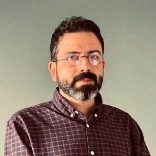

# Teachers

|  Dr. Mila Koeva |   |
|---|---|
|   | Mila Koeva is a senior Associate Professor (ius promovendi) in “3D city digital twins based on geospatial     technologies for improved land management and urban planning” at the University Twente, International Institute of Geo-Information Science and Earth Observation ITC, The Netherlands. She has a PhD on “3D modelling in architectural photogrammetry” from the University of Architecture, Civil engineering, and Geodesy in Sofia. She also holds an MSc. degree in Engineering (Geodesy) from the same institution.   Her expertise includes geospatial and remote sensing data processing and fusion using innovative methods and user engagement.  She is working on 3D modelling and Digital Twins in support of resource management and decision-making for cadastral and urban planning applications, among others.  Her career includes ten years of working as a photogrammetric specialist and head of the photogrammetry department (www.gis-sofia.bg) with the main aim of producing accurate cadastral and topographic maps and three years of work in a private organization (www.mapex.bg) leading three EU projects related with geodetic, cadastral and photogrammetric activities.   Currently, she is leading [Digital Twin Geohub](https://www.utwente.nl/en/digital-society/research/digitalisation/digital-twin-geohub/) in UT and is part of several European projects.  She was a Project Coordinator/Leader of [its4land](http://www.its4land.com/), a multidisciplinary European Commission Horizon 2020 project involving 8 academic and private-sector partners and 6 countries in Europe and Africa. Due to her scientific activities, she has been selected to have an active part in international professional organizations, chairing working groups and organizing scientific events, e.g. chairing [ISPRS WG IV/9](https://www2.isprs.org/commissions/comm4/wg9/) on Digital Twins, FIG WT 7 on AI4LA, etc.  Besides research international project activities, she is involved in education, including lecturing, course development, and supervision of MSc and Ph.D. students. In March 2017, she was ranked as one of the TOP 3 teachers of ITC 2016 - 2017; in 2016, her student obtained 3rd place in the Copernicus Masters Competition; in 2021, her student was awarded the Best [3D GeoInfo](https://3dgeoinfo2021.github.io/) paper,  and in 2023, her student received the second-best [MSc thesis](https://essay.utwente.nl/97045/) award in The Netherlands.   A full list of scientific publications can be found on [**Google Scholar**](https://scholar.google.nl/citations?hl=en&user=1oRWuWsAAAAJ&view_op=list_works&sortby=pubdate) and [**UT-site**](https://research.utwente.nl/en/persons/mila-koeva/publications/).   |

| Dr. Pirouz Nourian  |   |
|---|---|
|   | Pirouz is a generative design technologist and theorist actively researching the utilization of simulation-driven complexity sciences (generative sciences), digital twinning, and mathematical modelling for contributing to sustainable urban development. He is developing mathematical, computational, and gamified methods for augmented urban planning, urban design, and participatory housing development.    Current Position: Senior Assistant Professor of Digital Twinning (tenured) @University of Twente, ITC Faculty of Geoinformation Science and Earth Observation, Department of Urban and Regional Planning and Geoinformation Management (Jan 2023 onward).  A full list of scientific publications can be found on [**Researchgate**](https://scholar.google.nl/citations?hl=en&user=1oRWuWsAAAAJ&view_op=list_works&sortby=pubdate) and [**UT-site*](https://research.utwente.nl/en/persons/pirouz-nourian/publications/).

| Ivan Cárdenas, MSc.  |   |
|---|---|
|   |Iván L. Cárdenas-León is a PhD Candidate at the Urban and Regional Planning and Geo-Information Management Department from the Geo-information Science and Earth Observation Faculty at the University of Twente. He received his B.Eng. in Envirnonmental and Sanitary in 2015 at Universidad de La Salle in Colombia. He received a PG-Diploma Specialization in Geographical Information Systems from the joint program of Universidad Distrital Francisco José de Caldas and the Instituto Geográfico Agustín Codazzi in 2017, and his M.Sc. degree in Geo-information Science and Earth Observation with a specialization in Urban Planning in 2023 at ITC-UT. His research focuses on implementing Digital Twins for urban 3D Planning support to foresee the impactas and relations on water supply, urban heat island effect and housing. Along with his academic career, he has accumulated five years of experience as a GIS analyst for projects on Reforestation and environmental compensation; Environmental Impact Assessment; Emerald, Gold and Iron Mining; Oil&Gas environmental compliance reports; Flood modeling and risk assessment; and Urban and Regional planning. By applying graphic design, programming, spatial and data analysis techniques in a single product, he creates products that communicate the reality and complexity of the territory and project designs.  [**Get to know more**](www.overlaymaps.com) and see his [**Research profile**](https://research.utwente.nl/en/persons/ivan-cardenas-leon/publications/) | 